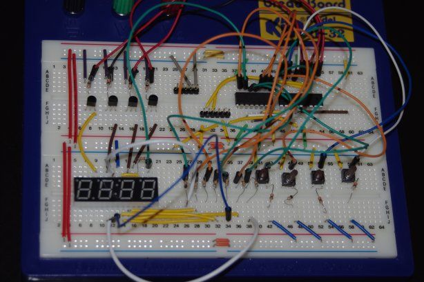
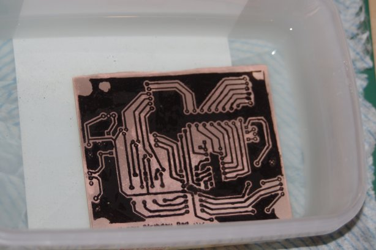
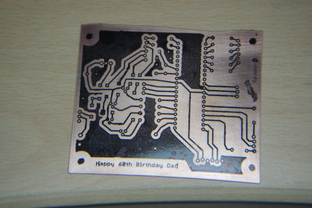
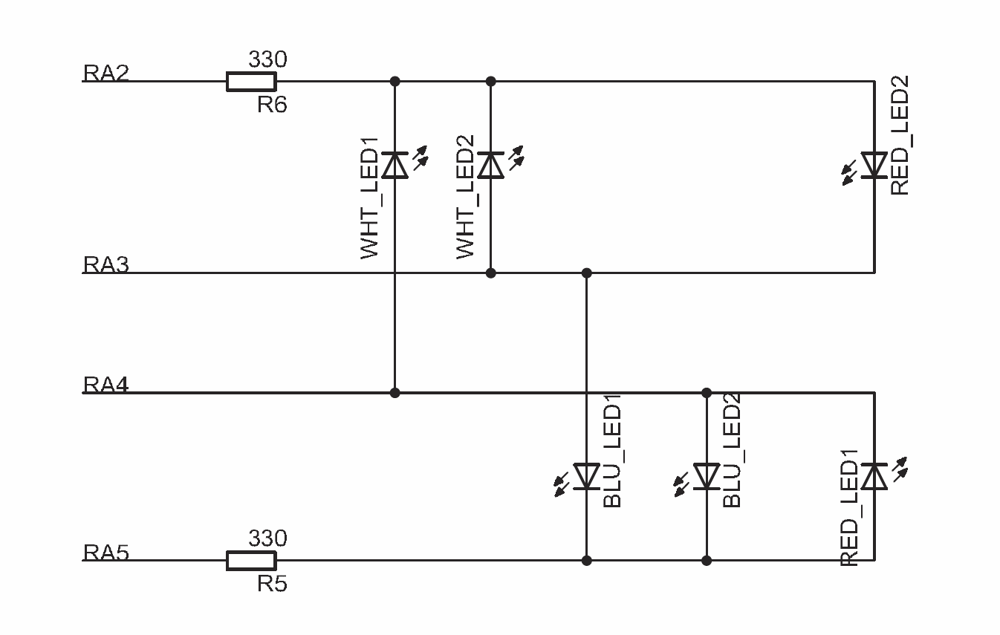

+++
title = "Chez D'Alert: PIC Countdown Alarm"
description = "A summary of a project I build for my Dad's birthday."

aliases = ["/chez_dalert_pic_countdown_alarm", "/post/chez_dalert_pic_countdown_alarm"]

[taxonomies]
tag = ["projects", "electronics"]
+++

For my Dad's 60th birthday, I wanted to make him something a bit special. Dad
spends a fair bit of his spare time in his shed "doing woodwork" and building
some really nice pieces of furniture. However he is a busy man and sometimes
only has a little bit of spare time to plane a few bits of timber, use a
thicknesser or whatever woodworky stuff he does. So I decided the best possible
thing to make would be a PIC countdown Alarm so that he can use his time in the
shed efficiently

As a friend of mine mentioned, he can even use it to time lacquer and stains for
drying and curing, so its not all about getting his nose back to the grindstone
on time!

Thus, the Chez D'Alert (pronounced Shed Alert in Australian) was born, a PIC
based countdown timer with a laser cut body. In this article I'm going to
describe a bit about the design process, and in particular some of the lessons I
learned through the process.

## The PIC Countdown Alarm Design

### Enclosure

Custom laser cut acrylic, designed in SolidWorks and transferred to Inkscape for
laser cutting.

### Inputs

Four buttons - +1 minute, +15minutes, start/stop and reset. Custom software
debounce routine.

### Outputs

A seven segment LED display, multiplexed.

### Electronics

Main controller board with PIC16F877A. IO board with buttons and displays.

---

As this was my first properly complex, permanent electronics project I didn't
try to do anything too flashy. Basically the PIC countdown timer has four
buttons, a seven segment display, a buzzer, some LEDs and a microcontroller to
control it all. You set the time with two buttons, then start/stop and reset the
timer using the other two buttons. When the timer runs out, the buzzer beeps and
the LEDs flash.

I put a bit of effort into the enclosure which is basically a laser cut version
of Melbourne's skyline. I've seen quite a few articles and forum discussions
about whether you should design your PCB or enclosure first, however in this
case the enclosure would be custom made, and as size was not a particular issue
I decided to design the schematic and PCB first. The final design had two boards

- an IO board with buttons and a display, and
- a main board with the PIC, buzzer, and most of the passive components.

This was partly because the IO board required very thin traces so I had it
manufactured, but also because it fit better in an enclosure with the buttons
and display slightly elevated.

The original design had a PIC16F628A, however it quickly became apparent that a
board with more IO pins would be a better option. From Rev C of the main board I
switched to a PIC16F877A, mostly because my preferred online hobby store had
them in stock!

## The Final Product

So, after quite a bit of back and forth and a lot of revisions, the final
product was completed. Some photos are shown below, and I hope to have some more
once Dad takes some of it in place (he's 17,000km away so it takes a while for
the emails to get here).







There were some issues with the finished design - basically I mucked up in
Solidworks, and as I hadn't built anything when I sent the enclosure off for
manufacturing, I had the button holes about 10mm from where they should have
been. This was mainly because I had assumed the IO board would be centred on the
main board, but because of the heat sink it was not. The enclosure had to be
"customised" later with a drill and some paper labels which ruined the look a
little bit. The original button labels were laser engraved in and looked quite
professional.

One of the features that I wanted to add was to have flash LEDs when the timer
went off. My idea was to have several colours (I settled on white, blue and red)
with two LEDs of each type that were turned on at the same time. To reduce the
number of pins that were required to drive this, I decided to [Charlieplex the
LEDs](/chez-dalert-pic-countdown-alarm). The circuit is shown below. Basically
by setting the pins to a combination of +5v, GND or "disconnected" I could turn
on just two LEDs at a time by only using four pins. (On reflection it would have
been better to do this with three pins!)



The code to run this was fairly simple, basically I used the arrays below to OR
with TRISB and PORTB, setting the pins to the correct mode. You can see the full
working version in the C source code attached below.

```c
const uchar LED_TRISB_OR[] =
{
    0b00111100, // off
    0b00000100, // blue
    0b00100000, // white
    0b00000000 // red
};

const uchar LED_PORTB_OR[] =
{
    0b00000000, // off
    0b00011000, // blue
    0b00011000, // white
    0b00100100 // red
};
```

## A Few Gotchas

I came across a few gotchas throughout the design which I'll describe here in
the hope that somebody will find them useful!

I ended with about Revision E of the main board and D of the IO board. The
original Rev A designs had a PIC16F628A, however it quickly became apparent that
a board with more IO pins would be a better option. From Rev C of the main board
I switched to a PIC16F877A. I chose this chip because I was time and budget
constrained, and my local hobby store had them in stock. In reality (and if I
had the ability at this stage to comfortably solder SMD parts) an SMD chip with
a real time clock and "nanowatt" power mode would be a better option.

The main electronics issues I ran across were:

- ICSP - In the first prototype I forget to add an ICSP to my circuit. Don't do
  this! For a prototype you would be insane not to include this port - it only
  needs a few connectors but its impossibly painful to try to debug the software
  without it!
- I had some issues with RA4 on the PIC16F628A, before I re-read the datasheet
  and noticed it was an "open drain". This mean it can't really be used for
  output unless some additional circuitry is used. The lesson learned here is to
  thoroughly read the datasheet before ordering any parts and re-read it again
  before soldering!
- My PCB manufacturing technique was not perfected, and I had some issues with
  traces and ground planes being "smushed" during toner transfer and bridging.
  The solution was to buy a laminator to do the toner transfer, and to increase
  the isolation in eagles DRC rules. In the case of the IO board I had it
  manufactured for me.
- Sometimes the PICKIT2 would freeze, all lights on, when attempting to read or
  program a chip using ICSP. I eventually worked out that this was because the
  software had reset the power voltage from 5V to 2.5V. Setting the voltage to
  5v again stopped the PICKIT2 from freezing
  
## Better Luck Next Time?

Without meaning to use Dad's birthday present as a bit of a guinea pig, it has
kind of turned out that way. The experience has taught me a lot about how to
approach my next design task, and in particular the importance of a thorough
testing / prototyping / breadboarding stage. The PIC Countdown Alarm turned out
ok, but I could probably have got there in a lot fewer iterations with a bit
more effort in the design phase!

If I were to do the project again, or a similar one, I might do a few things
differently:

### Micro Selection

I originally chose the PIC16F628A for the project because I had used this
before, had a few development boards built, and was familiar with the basics. On
reflection, this chip is unsuitable for a number of reasons - firstly it didn't
have enough IO pins, meaning that an additional shift register was required, but
secondly it is not a low power chip. The final chip I selected does not have the
XLP features of some PIC chips, so is probably not ideal, but was what I could
get a hold of in the time/budget I had available. For future projects I would
spend a lot more time selecting an appropriate chip, and would be more likely to
order one from RS or something especially (extremely high shipping costs aside).

### Component Types

I used DIP / through-hole components for the design but I think for future
projects I would really like to give SMD components a go as it will give me more
room to route the boards and make smaller PCBs. This will require a bit of
experimentation to make sure the PCB manufacturing accuracy is high enough,
or...

### Make vs Buy PCBs

My original plan was to make the PCB as a way of saving a bit of cash and also
because I felt it would be a bit more "personal". In the end I think it has cost
me more money from buying materials, remaking and certainly has taken a lot
longer with a poorer quality output. The jury is out on this one!

> **NOTE FROM 2020 Will** the jury is no longer out on this one, since 2012 an absolute truck
> load of low-cost, high-quality PCB prototyping services have emerged
