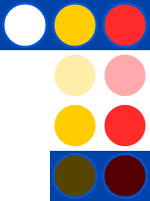
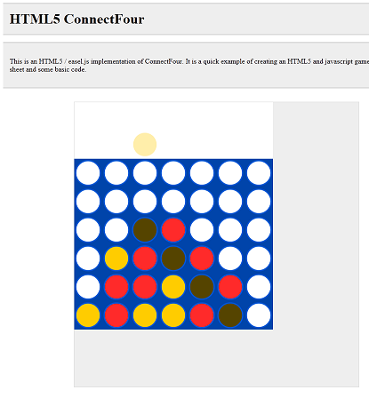

+++
title = "HTML5 Game using easel.js"
description = "A description of a Connect 4 clone I build using EaselJS"

aliases = ["/html5_game_using_easeljs", "/post/html5_game_using_easeljs"]

[taxonomies]
tag = ["code", "projects"]
+++

As an exercise I recently wrote an HTML5 game using Easel.js, which is a
relatively cool javascript library that helps when working with canvas objects.
Although I did find the easel documents a little confusing to begin with, it
only took a handful of hours before I had a working Connect Four game!

For those with a short attention span, you can [find out what Connect Four
is](http://en.wikipedia.org/wiki/Connect_Four), view the [source
code](https://github.com/will-hart/html5-connect4), or ~~play the game~~.

The `easel.js` code is actually a lot simpler than it looks. Basically a
spritesheet is used for the graphics and BitmapAnimation objects are used to
show the particular image on screen. The animations are set to single frames
without repeating.

A Timer is used to call `stage.update()` at about 60 frames per second, and then
some mouse event handlers are added for:

1. Hovering over the top of a row
2. Clicking on the top of a row to place a disc

Finally a function had to be written to determine if there was a winner when a
disc was placed. This was done with some basic recursion - have a look at the
`checkForWinner()` function [in the source
code](https://github.com/will-hart/html5-connect4/blob/master/js/connect4.js#L170).
