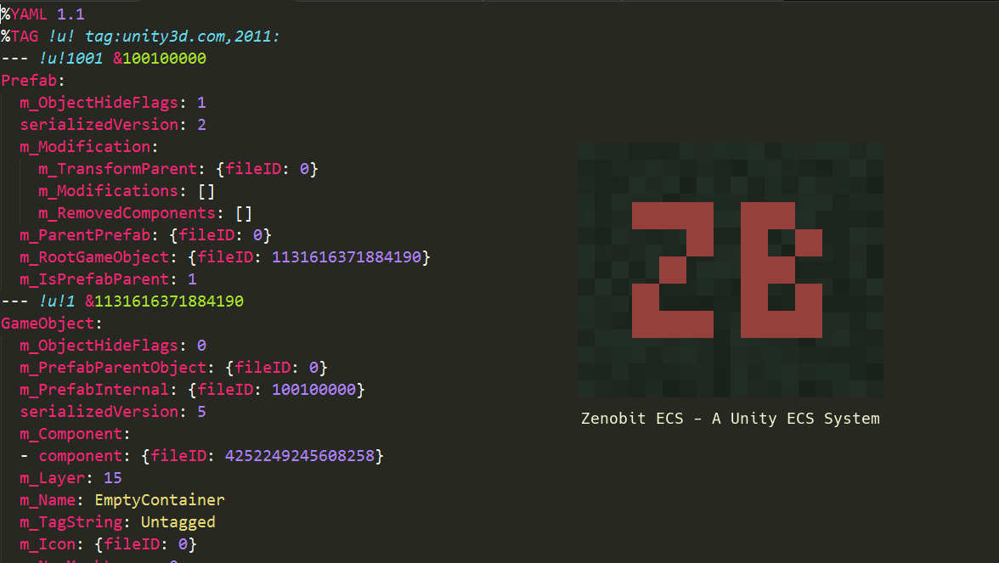

+++
title = "Zenobit's Unity ECS (part 1)"
description = "Part 1 of a look into a custom ECS for Unity"

aliases = ["/zenobits_unity_ecs_part_1", "/post/zenobits_unity_ecs_part_1"]

[taxonomies]
tag = ["code", "gamedev"]
+++



> I've recently started a collaboration with Zentropy under the name Zenobit
> Studios - for now you can find us at @ZenobitStudios on Twitter if you want to
> know more.

Our first project was the November 2016 GitHub Game Jam, where we spent a month
creating a very basic RTS. The game wasn't that great (and our artist went AWOL
which didn't help), but we had a working RTS with a multilevel enemy AI by the
end of it.

For the game jam, our RTS was built on the back of an "ECS Architecture", and I
want to describe here why we both thought that this was a good approach for game
architectural design that can be applied to many different game genres.

> I should probably point out at this point that I don't believe there is any
> such thing as "the best" architecture in software. In fact, the following is
> 100% subjective and opinion based. Your opinion may differ, which is fine. If
> you do want to chat about it, hit us up on Twitter or the comments below.

As this post turned out to be quite long, I think I'll break it up into three
parts. In this first part I'm going to give some background on ECS
architectures, and some of the decisions which lead us to write our own. In the
second part I'm going to go into why we thought a pure (non-Unity) ECS was
worthwhile, and I'll finish off in the third part with a practical example.

## What is an ECS?

ECS stands for Entity Component System, which refers to an architectural
pattern. I'll just put this here from
[Wikipedia](https://en.wikipedia.org/wiki/Entity%E2%80%93component%E2%80%93system):

> Entity-component system (ECS) is an architectural pattern ... [that uses]
> composition over inheritance... Every Entity consists of one or more
> components which add additional behavior or functionality. Therefore, the
> behavior of an entity can be changed at runtime by adding or removing
> components.

In other words, a generic ECS system is just an approach to structuring the code
of a game which uses:

- **Components** to hold data and compose the way an Entity acts,
- **Entities** to bundle together components, and
- **Systems** to apply game logic to the data

For example, an `Entity` can be composed by adding `Components` together. An
enemy could be made up from `Health`, `Movement`, and `Shield` components.

Various systems perform mutations on that data, (although some purists may
prefer Components to be immutable) for instance a `MovementSystem` might find
all the `Movement` Components and update them to move the entity around the game
world.

While there are many different ways to build an ECS, generally a key criteria is
that components are very loosely coupled. This means there are few links between
them, and each in theory is only responsible for its own particular area of
interest, such as tracking Health, or Shield status.

## Why not just use Unity's standard approach?

At this point I picture you yelling at your screen. What I described above was
very similar to Unity's standard approach of `GameObjects` (entities) and
`MonoBehaviours` (components and systems). Unity's approach could certainly be
viewed as a brand of ECS, and in fact most of the things you can do with a
"pure" ECS you can do within Unity's structure. However, as I hope I'll show in
this series, doing it in plain C# is just a bit less... well, a bit less _ugly_
and a lot more flexible.

I'm going to take a simple example, and consider it from a number of angles
below. Say you have an enemy Entity with `Health` and `Shield` Components (or
MonoBehaviours). `Shield`s have `Energy` which reduces damage, but not every
enemy has a shield.

In the traditional Unity approach you would put the `Health` and `Shield`
components on the same `GameObject`, then either link them in the Inspector or
cache references to the other `MonoBehaviours` in the `Awake` or `Start`
methods.

> Caching MonoBehaviours is pretty much standard practice in Unity because
> people say that GetComponent is a little slow, although its not clear that this
> is still true. FindXXX on the other hand should be used with caution as it
> iterates over every GameObject and Component in the scene!

In the "pure" ECS approach you may have a `HealthSystem` and the enemies would
be represented by Entities, some of which just have a `HealthComponent`, while
others have a `HealthComponent` and a `ShieldComponent`. This is the composition
part both Unity and pure ECS systems offer - if the Entity has a
`ShieldComponent`, then it adds the "shield behaviour".

The Unity version might look like this:

```cs
public class HealthComponent : MonoBehaviour
{
    public float Health;
    public float MaxHealth;

    [SerializeField] private ShieldComponent shield;

    public void TakeDamage(float damageCaused)
    {
        Health -= shield == null ? damageCaused : shield.GetDamage(damageCaused);
    }

    private void Update()  { // regeneration logic }
}

public class ShieldComponent : MonoBehaviour
{
    public float Energy;

    public float GetDamage(float damageCaused) { // logic }
    private void Update()  { // regeneration logic }
}
```

It's relatively easy to follow, however there is a dependency between the Health
and Shield logic, and the logic is spread out over two classes.

The "pure" ECS implementation on the other hand may look like this:

```cs
// The System
public HealthSystem : AbstractEcsSystem
{
   public void Update()
   {
      // find damage, shield energy and current health
      // reduce shield energy and health as required
      // set DamageReceived to 0 once handled
   }
}

// The Components
[Serializable]
public HealthComponent : AbstractEcsComponent
{
   public float Health {get; set;}
   public float MaxHealth {get; set;}
   public float DamageReceived {get; set;}
}

[Serializable]
public ShieldComponent : AbstractEcsComponent
{
   public float Energy {get; set;}
}
```

Interestingly, we are no longer exposing public methods - all the logic is done
in Update. This reduces the "surface area" of our API, making it much easier to
debug - if something goes wrong, we generally only need to look at one method.

To replace public methods, such as weapons calling
`healthComponent.TakeDamage(4f)`, we now modify component data, for instance by
executing `healthComponent.DamageReceived += 4f`. When the system runs, it uses
these values to allocate damage.

If logic and data are separated, and each System is responsible for only doing
one thing, then its very hard to have 1,000 line mega classes. Our longest
system is 167 lines long including comments, file headers and so on, but the
majority are a lot less than 50-100 lines all up. These systems are standalone,
responsible for only one thing, located in the same place in our namespace
hierarchy, and are generally trivial to understand.

@@ Aren't there already ECS systems?

Both @Zentropy and I (the two parts of Zenobit) were familiar with Unity, but
uncomfortable with a lot of the design decisions in the underlying framework, or
at least with the way that Unity encourages you to design your code.

We had both briefly considered other mature ECS solutions such as
[Entitas](https://github.com/sschmid/Entitas-CSharp), however there were aspects
of most systems that we weren't happy with and they seemed quite heavyweight for
what we were after.

We had both independently started developing our own very lightweight ECS
frameworks in plain C# before we started making games. Mine grew from [this
snippet](https://gist.github.com/will-hart/4dce1335d05d34dfbc32d61d32e56b5b).
When we began to collaborate, we brought the best of our systems together, and
what we've ended up with what we think is a fairly robust, lightweight
architecture for developing games. Of course, we are only developing our second
game using the system so it's possible we will totally change our mind in a few
months!

## In Conclusion

Ok, I think that's enough setup for now! In [Part 2](/zenobits-unity-ecs-part-2)
of this series, I'm going to step through some different scenarios where we
think a "pure" ECS approach provides some benefits.
