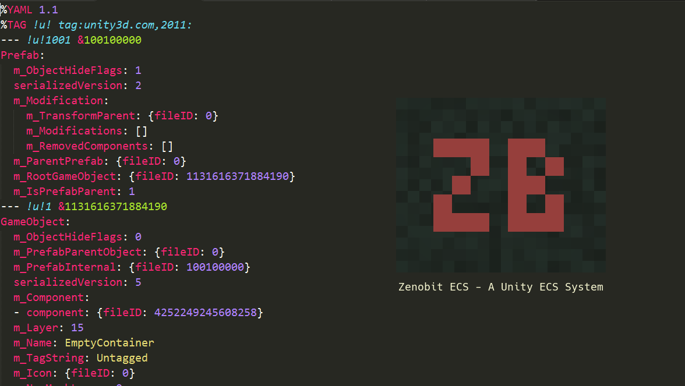
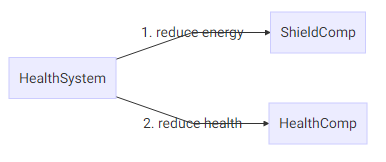

+++
title = "Zenobit's Unity ECS (part 2)"
description = "Part 2 of a look into a custom ECS for Unity"

aliases = ["/zenobits_unity_ecs_part_2", "/post/zenobits_unity_ecs_part_2"]

[taxonomies]
tag = ["code", "gamedev"]
+++

In the [first part](/post/zenobits-unit-ecs-part-1), we introduced the ECS
architecture and explained a bit about why we chose to avoid Unity's standard
architectural approach. We also set up an example, using entities with both a
`HealthComponent` and an optional `ShieldComponent`.



In this part I'll go into some more detail, using this example, of some specific
areas where we thought a pure ECS offered some benefits. Zentropy has provided
some value suggestions for this article, and again I'd like to point out that
this is purely our opinion, and we'd welcome discussion!

## Separation of Logic and Data

As I touched on in the first part, a major difference between a pure ECS and
Unity's approach to ECS is that Unity encourages merging components and systems
into the same class, that is: data and logic are in the same place. This
approach works quite well for small or simple projects, however as the project
grows in complexity, I'd argue that it can quickly lead to a code base that is
tangled up and confusing.

Already we can see a potential confusion in our Health / Shield example. We have
placed our logic in the `HealthComponent`, but in order to determine how much
damage to take, the `HealthComponent` has to access the `ShieldComponent`.
However, the `ShieldComponent` may also need its own logic to determine how much
damage it saves.

All of a sudden, our components are no longer standalone, and there is a
dependency between them which looks like the following:


This is usually resolved by making everything public on MonoBehaviours, or
exposing public methods, which isn't too different to the ECS approach.

However, two issues remain. Either:

1. Our damage logic is spread over two (or more) files, or
2. Components are responsible for setting values on other components, which
   violates the single responsibility principle.

In the pure ECS approach, this problem is resolved by moving logic "up" a level.
The logic is placed in a `HealthSystem`, which reads in the component data, and
allocates the appropriate amount of damage to shield energy and current health.
The dependencies now look a little like this (assuming current shield and health
levels are accessed publicly)



Now arguably there isn't a huge difference between ECS and Unity here in this
simplistic example, but in my mind the ECS approach is considerably cleaner -
the logic is all in one place, and the Components don't do _anything_ except
hold data.

When all our logic is in standalone systems, our game itself (i.e. not just the
entities) becomes composable. For instance we can build up our game from
systems:

```cs
Ecs.AddSystem(DamageSystem);
Ecs.AddSystem(HealthRegenerationSystem);
Ecs.AddSystem(MovementSystem);
```

Functionality can then be turned on or off in one place in the code base, by
adding or removing a single line where we "bootstrap" our ECS. This is much
harder to do when the logic is scattered throughout MonoBehaviours and prefabs.

## Managing Links Between Components

Writing our own ECS let us have complete control over the lifecycle of the
classes that it contains via their constructors. We can use this to provide
efficient methods for accessing either specific components on an entity, all
instances of a component type, or a subset of components.

If we wanted all Components of a given type currently in the game with Unity, we
would need to do something like this:

```cs
var healthComps = Object.FindObjectsOfType(
    typeof(HealthComponent)) as HealthComponent[];
```

This approach loops through every game object and component in the scene, which
quickly becomes performance prohibitive.

In our ECS, we can do:

```cs
var healthComps = _ecsEngine.Get<HealthComp>();
```

Internally, our ECS approach uses a Dictionary lookup, which in the normal, best
case is `O(1)` - i.e. it takes the same amount of time no matter how many
Components we have.

As we have complete control over the construction of Components and Entities, we
can also trigger `Events` when Components are added or removed from the ECS
system.

This lets us do neat things; we can create lazily evaluated `Matcher` classes
that retrieve components based on a specific criteria, and only update when the
underlying ECS data changes. In our example, we can use this to track all
Entities with a `HealthComp` but not a `ShieldComp`, and be guaranteed that this
is up to date:

```cs
// field declaration
private Matcher _noShieldEntities = new Matcher()
        .AllOf(ComponentTypes.HealthComponent)
        .NoneOf(ComponentTypes.ShieldComponent);
```

These can then be accessed by calling `_noShields.GetMatches()`, which returns
`IEnumerable<EcsEntity>` and is evaluated lazily, and only if the underlying
data structure is "dirty".

This gives us improved performance and flexibility relative to Unity's standard
approach, but perhaps more importantly the logic for this is hidden inside the
ECS implementation, and doesn't clutter up our Components themselves.

## Serialisation

Taking our `Health` and `Shield` entities again, lets assume there are 10 different
types of enemies. Half of them have shields, but all of them have different
shield energy and maximum health values. How do we handle this in Unity?

We could manage this with prefabs, however as we can't use inheritance here,
this approach scales very poorly. Unity's built in serialisation is a bit hit
and miss, but luckily there are several decent external libraries. We could load
data from file (XML, YAML or JSON), and then somehow overwrite, or manually
populate MonoBehaviours. Again this scales poorly for any sort of moderately
complex data structure and needs a fair bit of hand written logic if we want to
dynamically add or remove components.

By contrast, the ECS approach has the following structure


The key here is that we are just serialising / deserialising data structures. As
we have complete control over the process we can determine when and how Unity's
game objects are created, pooled or destroyed. Unity has become a _GUI_ for our
game. It is trivial to serialise an entire Entity, or a group of Entities, load
them in and attach "display" game objects to them.

As our entire ECS is serializable and housed in a single location, saving games
suddenly becomes a lot simpler - we just serialize our ECS system to file (see
note 1).

## Portability

The way our ECS is designed, we essentially use Unity as a GUI, which overlays
our game architecture. Unity does a couple of things:

1. Handles user input,
2. Provide a physics engine (i.e. notifying the ECS when a collision occurs,
   handling projectile ballistics, etc),
3. Displays the current state of the game to the player

In specific instances, such as collision handling, or UI we use "bridging"
MonoBehaviours, which inject data from Unity methods such as `OnCollisionEnter`
into our ECS. These are the only Unity specific aspects of the game architecture
and are usually very simple 1-2 line methods.

In theory, this means we are less bound to the Unity ecosystem. If we decided to
move to Godot once C# support landed, we would only have to replace the
"bridging" classes and the rest of our game logic could remain almost the same
(see note 2).

## Performance

This may be a bit of stretch, but by Unity's [own
analysis](https://blogs.unity3d.com/2015/12/23/1k-update-calls/) (and admittedly
on iPhone builds), using Unity's Update magic method was $5-20\times$ slower
than just calling a bare update method. This may not add more than a few
milliseconds per frame (2-18ms added with _10,000_ `MonoBehaviour` instances) so
the impact is not huge, but if the MonoBehaviour's can be avoided than that's an
easy performance pickup. At the end of the day, why carry around the whole
MonoBehaviour or ScriptableObject baggage when in these instances the
functionality isn't being used?

(Of course, it possible that this performance gap will decrease over time as
Unity optimises further).

## Refactoring and Adding Features

A side effect of following the single responsibility principle, is that when its
time to refactor code it becomes a lot simpler. If we want to change the way
that damage logic works, we just go to the DamageSystem and edit that file, with
no need to hunt through any other classes. This is true of both Unity and pure
ECS approaches, but as we've seen the Unity approach sometimes leads to logic
being spread out amongst different classes.

Similarly, adding new features becomes relatively easy. Say we want to introduce
a system which can take energy from shields and add it to health. All we need to
do is create a system that looks a little bit like our health system, runs after
it, and transfers shield energy to health.

We could of course add these same lines to our `HealthComponent` in a Unity
approach, (although as noted this creates interdependencies in our components),
but under the ECS approach, we don't have to touch any of our other code to make
these changes, which reduces the chance of introducing unwanted bugs.

One potential pitfall here is that if we add a lot of systems like this you can
see that we might end up looping through the lists of shield or health
components a lot. For very large games, perhaps this might cause unwanted
performance issues. My usual mantra here is to implement it first, then if the
profiler suggests we are spending too much time looping through components, we
can start to consolidate and otherwise optimise our systems.

## Having a single source of truth

Actually, it turns out that having a single source of truth - i.e. a container
which holds all relevant information is extremely useful for certain features.
In particular I'm thinking of AI. Our in-house AI system is based on GOAP (see
note 3), and to make sensible decisions it needs to be able to efficiently query
the game state and ask a wide variety of questions. Our AI would be several
orders of magnitude more difficult to implement if we weren't able to use our
ECS to find / match and interrogate game state through the ECS.

## Its not all bad, right?

I wouldn't say the Unity design approach doesn't work, in fact I've happily used
this type of architecture on lots of other projects.

There are some definite weaknesses of our ECS approach:

1. A lot of our performance gains in terms of querying for Components and
   Entities comes at the expense of increased memory usage
2. Using Unity's physics and colliders etc requires a level of indirection to
   work
3. The ECS approach probably requires more overall code to be written, even if
   the individual methods and classes are small(er).

In our case, and despite these compromises, we felt that our custom ECS offered
a cleaner, more reusable architecture that we could apply to multiple different
game styles. Hopefully I've given you a bit of an insight into our reasoning.

In the [third and final instalment](/post/zenobits-unity-ecs-part-3) of this series,
I'm going to give an example of how we implemented a particular feature in our
ECS for our current game project so you can see how this would work "irl".

## Notes

1. In theory :) In practice we aren't at this stage yet...
2. Again... in theory :) In practice, this is probably unlikely, but its nice to
   be less dependent on one particular ecosystem.
3. GOAP stands for Goal Oriented Action Planning. Read more about it
   [here](http://alumni.media.mit.edu/~jorkin/goap.html)
