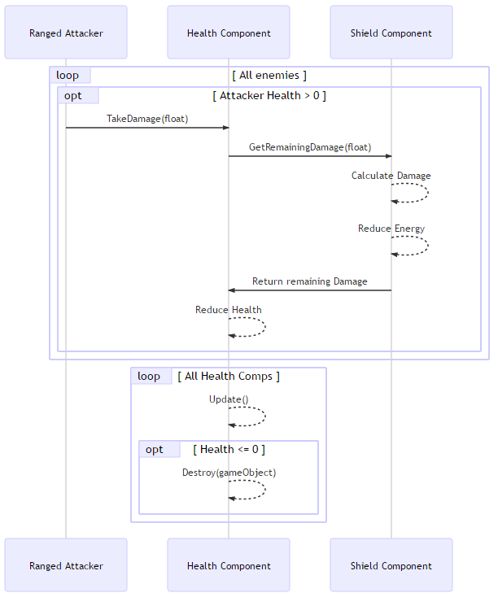
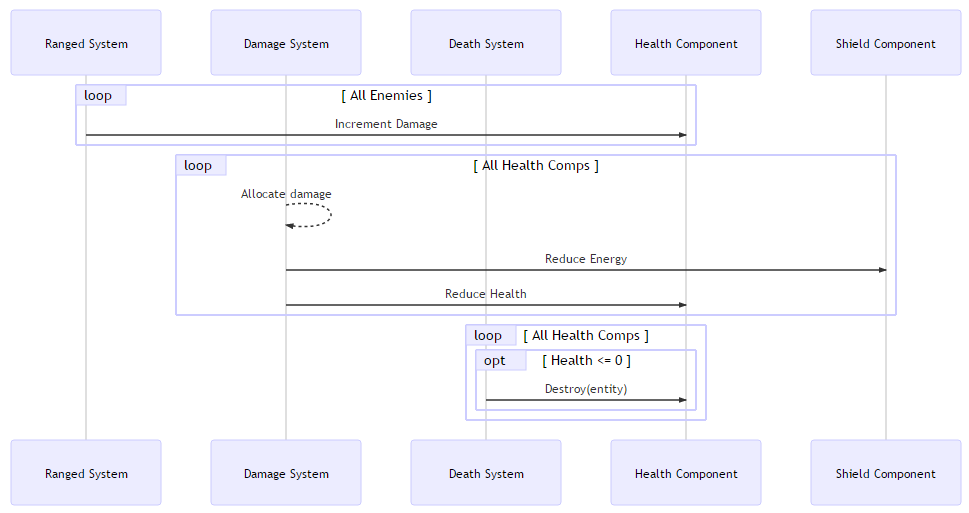

+++
title = "Zenobit's Unity ECS (part 3)"
description = "Part 3 of a look into a custom ECS for Unity"

aliases = ["/zenobits_unity_ecs_part_3", "/post/zenobits_unity_ecs_part_3"]

[taxonomies]
tag = ["code", "gamedev"]
+++

This is the third and final part of my three part series on the Entity Component
System we are using at @ZenobitStudios.


In the [first part](/post/zenobits-unity-ecs-part-1), I discussed what an ECS is, and
why we chose this architecture for our games. In the [second
part](/zenobits-unity-ecs-part-2), I talked through several areas in which an
ECS offers some potential advantages over the "standard" Unity architecture. In
this third and final part, I'm going to describe a concrete example of how we
implemented a particular feature in our ECS.

## Show don't tell?

In the previous post I presented some concrete examples using an example where
we have Entities (or game objects) with a `HealthComponent` and a
`ShieldComponent`. We're going to take this a step further here and describe (in
a relatively hand wavy way) how we implemented ranged combat in our current game
project.

## Unity Version

I'll start by describing how I would normally implement a ranged combat system
in "Unity default" game architecture. I'm going to throw up a [sequence
diagram](https://en.wikipedia.org/wiki/Sequence_diagram) to describe the system,
and then step through it bit by bit.



You can see there are three participants in this approach - a "Ranged Attacker",
a `HealthComponent` and a `ShieldComponent`, which are MonoBehaviour derived
classes attached to the same GameObject. First, let's assume that we have some
sort of ranged attacker (hand wavy assumption #1) which raycasts / sphere
overlaps or whatever to find which enemies to hurt, and a weapon class (hand
wavy assumption #2) which stores weapon data.

Typically our attacker would then have a bunch of colliders to test against, and
there would be some logic:

```cs
// in our ranged attacker MonoBehaviour
private void Update()
  {
    if (GetComponent<HealthComponent>().Health <= 0)
    {
        Destroy(gameObject);
        return;
    }

    var hits = Physics.RaycastAll(
        transform.position, transform.forward, weapon.Range);

    foreach (var hit in hits)
    {
        var health = hit.transform.GetComponent<HealthComponent>();
        if (health != null) health.TakeDamage(weapon.Damage);
    }
}
```

This is the first loop in our sequence diagram, which is called on every
attacker's `Update` method. If the attacker has health > 0 (the `opt` bit in the
sequence diagram) then it calls the public `TakeDamage` method of any collided
`HealthComponents`. This then triggers the Health Component to find out if there
is an attached Shield Component. If there is, then it runs the shield's logic
and reduce health by any remaining damage. It might look something like this:

```cs
public void TakeDamage(float damage)
{
    var damageTaken = shield == null
        ? damage
        : shield.GetRemainingDamage(damage);
    Health -= damageTaken;
}
```

That's pretty straightforward, and I'll leave the implementation of
`ShieldComponent::GetRemainingDamage()` up to your imagination. We now need a
way to remove dead GameObjects. We could do this in the `TakeDamage` method on
`HealthComponent`, and just check if health is less than or equal to 0 and
`Destroy()` the game object. This could cause difficulties though, as now there
is a possibility that objects are destroyed before they have the ability to
attack back. In theory, whichever objects are higher in the `Update` order now
have an advantage.

To fix this, we need to move our "death" code out of the `TakeDamage` loop and
into an `Update` method. However, if you ran the code now, there would still be
a problem. By default, GameObjects are considered in the order that they were
instantiated in, then each MonoBehaviour on the GameObject has its `Update`
method called, in a slightly strange order.[1] We still can't guarantee that
ordering in the hierarchy won't have an impact on the outcome of ranged combat.
To fix this we need to set an order of script execution using the Script
Execution Order editor window. This way we can ensure all of the ranged attack
occurs before any `HealthComponent` destroys an entity. It works, but its a bit
confusing and arguably not very scalable.

There you go - the Unity system in a nutshell. Now let's take a look at how our
ECS tackled this.

## ECS Version

Once again, I'll throw out the sequence diagram for starters, then work through
it.



Immediately you can see there are a few more moving pieces. Now we have three
systems alongside our two components. The components have the same data attached
but the `HealthComponent` now has a `DamageReceived` property (see note 2), but
all logic has been removed from them.

Our systems run one at a time, in the order in which they are added to the ECS
when we bootstrap it. Each runs an Update loop, which for the `RangedSystem` may
look like the following (see note 3):

```cs
public void Update()
{
    foreach (var enemy in \_enemyMatcher.GetMatches())
    {
        enemy.Get<HealthComponent>().DamageReceived += weapon.Damage;
    }
}
```

It doesn't get too much simpler than that. Obviously there are some
implementation details around how we get the list of enemies to attack, (see
note 4) but the system itself couldn't be easier to understand.

The `DamageSystem` then runs, calculating how much damage goes to health and how
much to shields. It might look like this:

```cs
public void Update()
{
    foreach (var enemy in Ecs.GetAll<HealthComponent>())
    {
        var shieldTaken = 0;

        if (enemy.Has<ShieldComponent>())
        {
          shieldTaken = Mathf.Min(
              enemy.DamageReceived,
              enemy.Get<ShieldComponent>().Energy);

          enemy.Get<ShieldComponent>().Energy -= shieldTaken;
        }

        enemy.Health -= (enemy.DamageReceived - shieldTaken);
        enemy.DamageReceived = 0;
    }
}
```

This looks like a "lot" of code, but it combines the
`HealthComponent::TakeDamage()` and `ShieldComponent::GetRemainingDamage()`
methods from our Unity implementation into one place. Basically we allocate the
damage between shields and health and update them accordingly.

Finally we have our `DeathSystem` which removes entities when they die. It
probably looks something like this:

```cs
public void Update()
{
    foreach (var health in Ecs.GetAll<HealthComponent>())
    {
        if (health.Health <= 0) Ecs.Destroy(health.Entity);
    }
}
```

Again, we can tell at a glance _exactly_ what the code does, and we can
guarantee without any configuration or magic that it won't be executed until
after all damage has been dealt out.

As the systems operate on a "batch" of Components in order, and components are
complete standalone, then it makes race conditions unlikely. While Unity does
provide a workable solution to this issue in the Script Execution Order
settings, the ECS approach is _failsafe_ in that it protects against race
conditions by default.

## Comparing the two

So I'm sure you could look at the Unity or ECS code and suggest ways they could
be improved. However, they are after all just examples for illustration, and a
bit hand wavy as I promised.

Looking back at the two, the ECS architecture has a few more moving pieces, and
it probably results in a bit more code being written. However in my mind at
least, it provides a much simpler, more loosely coupled structure than the Unity
approach. Importantly:

1. None of the Systems depend on any of the other systems
2. Each of the Systems contains all the necessary logic to perform their
   function (recall that this also makes refactoring our code significantly
   easier)
3. The Systems do one thing, and only one thing
4. The Components just hold data, they don't do anything else

In my mind this makes for a more flexible, more extensible architecture.
Hopefully I've given you some insight into why we picked our particular approach
for game architecture, and how we get it to work. I'm sure you have your own
opinions and that's totally fine by me!

## Notes

1. I ran a few tests in Unity with some simple scripts to work out what was
   going on here. Strangely, it seemed that the execution order of
   MonoBehaviours differed on game objects depending on whether they were in the
   editor hierarchy or instantiated while the game was running. This has
   implications for game logic, and can create some pretty weird bugs if you
   aren't careful - actually this might be a good topic for another blog post!
2. In practice we store a list of structs in the DamageReceived property, which
   lets the system handle multiple different damage types and effects, but I'm
   trying to keep things manageable here :)
3. See part 2 of this series for details of the Matcher class
4. In practice we use Unity's colliders and a bridging MonoBehaviour to inject
   collision data into the ECS. The bridging class is very simple and can be
   reused for any entity which receives collisions.
