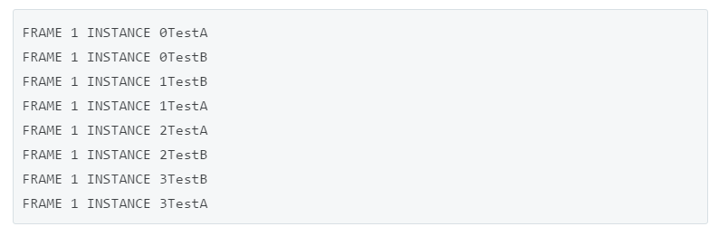

+++
title = "The Perils of Unity's execution order"
description = "A deep and confusing dive into Unity's execution order"

aliases = ["/the_perils_of_unitys_execution_order", "/post/the_perils_of_unitys_execution_order"]

[taxonomies]
tag = ["code", "gamedev"]
+++



I came across an interesting problem when I was posting about our [Zenobit
ECS](https://willhart.io/zenobits-unity-ecs-part-1) a while back. In our ECS I
had noticed that as when we retrieve a list of Components from our ECS engine
(say a list of "attack" components), they are always in the same order. This
meant there was the potential for some sort of bias to occur when resolving
attacks. For instance, entities that attacked earlier in each Update loop were
at an advantage if it meant that others were killed before they could fight
back.

As I was thinking about how this would work in Unity's preferred architecture, I
realised I didn't really know much about how Unity resolves its "order of
execution" of scripts by default. You can set the order that Mono Behaviours are
executed in the "Script Execution Order" (or SEO) settings panel, but I wasn't
really clear what happened if you scripts weren't in the SEO panel. Was this a
potential source of "hidden" bias or errors in Unity code? (There is only one
way to find out!)

Unity's documentation on Script Execution Order is... well not great. It
[contains the following
line](https://docs.unity3d.com/Manual/class-ScriptExecution.html):

> By default, the Awake, OnEnable and Update functions of different scripts are
> called in the order the **scripts** are loaded (which is arbitrary). However,
> it is possible to modify this order using the Script Execution Order settings

The emphasis is mine - the word "scripts" is highly ambiguous, and is not a C#
term. By script they could either mean the `Type`, i.e. `typeof(MyClass)` or an
instance, `var instance = gameObject.AddComponent(MyClass)`. Even after writing
this post, I still don't really know what they mean.

## What could possibly go wrong?

Why does the distinction matter? Well picture a scenario, similar to the ranged
combat example provided in [part 3 of my ECS
series](/zenobits-unity-ecs-part-3). You have two `GameObject`s, each can attack
the other game object, and it can also die if it is attacked. A simple
implementation, where we have a reference to the other game object `enemy` looks
like:

```cs
public class Attack : MonoBehaviour
{
  private void Update()
  {
    Destroy(enemy);
  }
}
```

The problem here is fairly clear - whoever attacks first, wins. If the attack
code on one game object is always executed first, then it will _always_ win the
combat. (In our ECS, this would mean older entities would always win combat as
they are at the top of the list).

To fix this, we could add a second MonoBehaviour, a `Death` component which
separately removes dead enemies. Our implementation now looks like:

```cs
public class Attack : MonoBehaviour
{
  private void Update()
  {
    enemy.GetComponent<Death>().IsDead = true;
  }
}

public class Death : MonoBehaviour
{
  public bool IsDead {get; set;}

  private void Update()
  {
    if (IsDead) Destroy(gameObject);
  }
}
```

However, under this approach, the outcome still depends on the order the scripts
are called in. Consider what happens if the execution order is the following:

```txt
Object A >> Attack
Object A >> Death
Object B >> Attack
Object B >> Death
```

This should result in both of the objects dying as they attack, then check for
death. But what happens if the following occurs:

```txt
Object A >> Attack
Object A >> Death
*Object B >> Death
*Object B >> Attack
```

Note the order the Components are Updated on Object B is now switched. Now
Object B dies before it can attack! Object A always wins and Object B always
dies, and once again there is a benefit in being higher in the game object
execution priority.

But can this ever happen? What does Unity actually do where we don't specify a
script execution order? What order are components called in, and how does Unity
work out which GameObject to Update first?

## Mapping Unity's Execution Order

Lets do a little digging. If I open up Unity and Visual Studio, I can make a
simple script to find out what Unity does under the hood:

```cs
public class TestA : MonoBehaviour
{
    private static int InstanceCount = 0;
    private int instanceId;

    private void Awake()
    {
        instanceId = InstanceCount++;
    }

    private void Update()
    {
        Debug.Log(
            "FRAME " + Time.frameCount +
            " INSTANCE " + instanceId +
            " " + GetType()
        );
    }
}
```

This script just increments a counter each time we add a new instance of the
class, then logs the frame number, instance number and class name in the
`Update` method.

I made a duplicate of this script, called `TestB`. In an empty scene, I created
a prefab from an empty game object with the `TestA` and `TestB` scripts attached
(`TestA` was above `TestB` in the hierarchy), and left one instance in the
scene. When I hit play, I got the following logs:

```txt
FRAME 1 INSTANCE 0 TestA
FRAME 1 INSTANCE 0 TestB
FRAME 2 INSTANCE 0 TestA
FRAME 2 INSTANCE 0 TestB
...
```

This is fairly straightforward. The execution order is the same every frame.

What if we duplicate the game object, so we now have two objects, each with the
two scripts attached?

```txt
FRAME 1 INSTANCE 0 TestA
FRAME 1 INSTANCE 0 TestB
FRAME 1 INSTANCE 1 TestB
FRAME 1 INSTANCE 1 TestA
FRAME 1 INSTANCE 2 TestA
FRAME 1 INSTANCE 2 TestB
FRAME 1 INSTANCE 3 TestB
FRAME 1 INSTANCE 3 TestA
```

_Ruh roh_... the order of execution on the second game object is switched - B,A
versus A,B on the first object! Maybe Unity just wanted me to spell out ABBA? In
fact, adding more game objects seems to repeat this pattern (ABBA ABBA ABBA),
although once I got (BAAB BAAB BAAB). So... um - what are the rules here? To be
honest, I have no idea, so I guess we just move on?

Lets set the difficulty level to _Ultra Nightmare_ by Instantiating a new prefab
every frame. I had to hit play and pause again really quickly to prevent too
much console spam... but now the log looks like this:

```txt
FRAME 8 INSTANCE 0 TestB
FRAME 8 INSTANCE 0 TestA
FRAME 8 INSTANCE 1 TestA
FRAME 8 INSTANCE 1 TestB
FRAME 8 INSTANCE 2 TestA
FRAME 8 INSTANCE 2 TestB
... many more lines
FRAME 8 INSTANCE 7 TestA
FRAME 8 INSTANCE 7 TestB
```

And a few frames later

```txt
FRAME 20 INSTANCE 0 TestB
FRAME 20 INSTANCE 0 TestA
FRAME 20 INSTANCE 1 TestA
FRAME 20 INSTANCE 1 TestB
FRAME 20 INSTANCE 2 TestA
FRAME 20 INSTANCE 2 TestB
... many more lines
FRAME 20 INSTANCE 18 TestA
FRAME 20 INSTANCE 18 TestB
FRAME 20 INSTANCE 19 TestA
FRAME 20 INSTANCE 19 TestB
```

Something really strange has happened - the instantiated objects always follow
the same pattern, A then B, while the editor placed game object executes B then
A.

Double ruh roh. I'm really confused now. I'm assuming something like this is
happening:

1. The execution order of MonoBehaviours attached to each game object is
   different depending on whether the GameObject was placed in the scene or
   Instantiated at run time
2. The behaviour of execution order for editor placed objects is different from
   instantiated objects
3. The game objects appear to be updated in the order in which they were
   instantiated
4. The hierarchy has no impact on execution order (verify this by pausing the
   game and rearranging the hierarchy)

I'm not even sure what to make of this - I think its best to just consider that
by default Unity executes Update methods completely arbitrarily, but usually
grouped by GameObject.

## Why does this matter, and can it be fixed?

If we execute all of the `Attack.Update()` calls, then all of the
`Death.Update()` calls, then both game objects will die every time they fight -
they both attack the other object in their `Attack` instance, then they both die
in the `Death` instance.

It definitely isn't a terminal problem - we can achieve explicitly set Script
Execution Order or perhaps do death removal check in `LateUpdate`. These
solutions both work, and are relatively straightforward to implement, but the
danger lies in the fact that the default Unity implementation relies on
_implicit_ and seemingly arbitary execution order.

There is the potential for a whole raft of insidious, unexpected and difficult
to debug logic errors to crop up, way beyond the complexity of our contrived
attack/die example here. This potential is made worse by the fact that the
default Unity behaviour appears to vary based on factors such as instantiation
order and instantiation method. To be absolutely certain of our execution order
we may need to **set script execution order on every single MonoBehaviour in our
game**, which seems to me to be a particular kind of hell.

Anyway, I hope this post has in some way helped you avoid some insidious, hard
to debug issues in your Unity Adventure!
