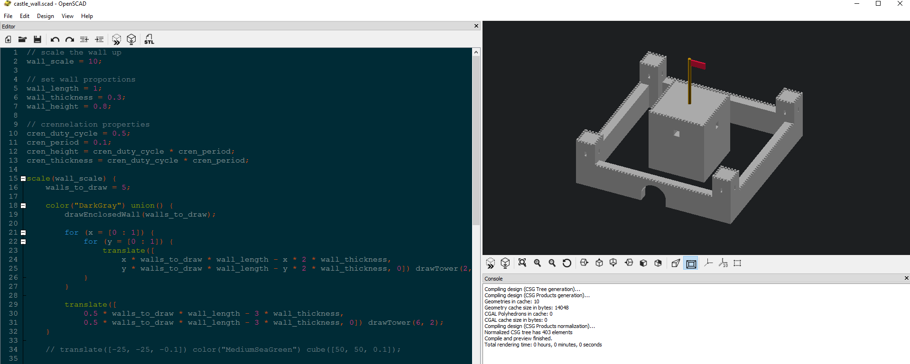
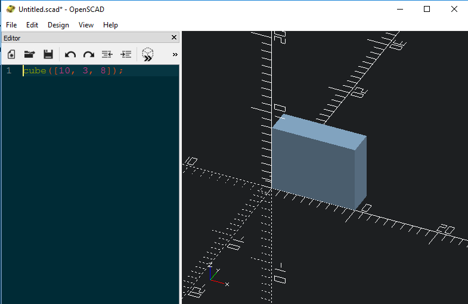
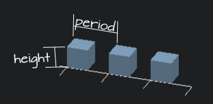
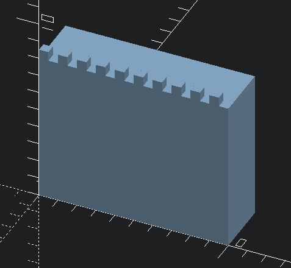
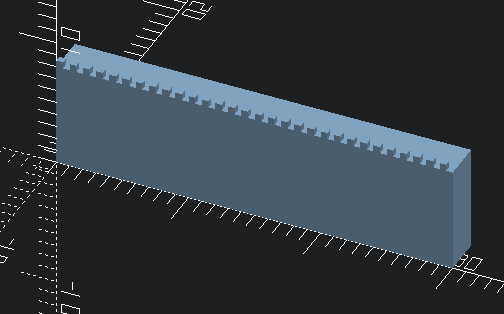
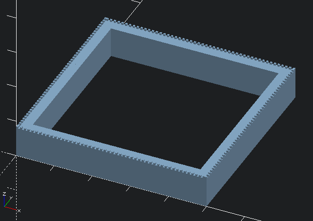
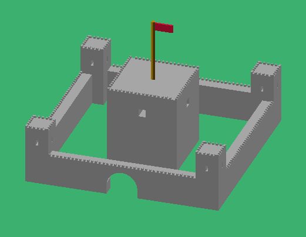

+++
title = "Making game assets using OpenSCAD"
description = "Using a surprising tool to build game assets, based on some work I did building samples for experiments at the Australian Synchrotron"

aliases = ["/game_assets_using_openscad", "/post/game_assets_using_openscad"]

[taxonomies]
tag = ["tutorials", "code", "gamedev"]
+++

In my day job, I have a task to [design some 3D printed parts in a variety of
repeating
patterns](https://www.osapublishing.org/abstract.cfm?uri=BGPPM-2018-JTh4A.2),
but with each part being just slightly different. I didn't really want to mess
about in SolidWorks making them in all sorts of different sizes and then
maintaining them every time the design specs changed. I decided what I really
wanted was a procedural CAD program so I could code the outputs.



After some messing about I found [OpenSCAD](http://www.openscad.org/) which is
billed as "the Programmer's Solid 3D CAD modeller". Basically you can script 3D
models using basic boolean operations like `union`, `difference` and `intersect`
as well as primitive shapes like `cube`, `cylinder` and `sphere`. The language
allows basic scripting including variables, `for` and `if` control statements. A
minimal example is a cube, which you make like this:



I wondered if I could use this as a really simple way to make game assets,
particularly building up a lot of basic shapes very quickly. I think the
technique is naturally suited to making things like castle walls which are
basically a `union` of lots of primitive shapes. So, lets begin!

## Blocking out the basic structure

Firstly, we can block out the structure of our wall. I'll just specify some
proportions, then use a scale value to `scale` it up to our preferred size:

```python
// scale the wall up
wall_scale = 10;

// set wall proportions
wall_length = 1;
wall_thickness = 0.3;
wall_height = 0.8;
```

Here we are specifying a base wall is 1 unit long, 0.3 units thick and 0.8 units
tall. We also want to scale the whole wall up by 10 units (A "unit" in OpenSCAD
is one millimetre, but that doesn't really matter here). We can scale and draw
our cube the same was as before, except now we use the variable values instead
of hard coding:

```python
scale(wall_scale) cube([wall_length, wall_thickness, wall_height]);
```

## Making crennelations

The next thing a castle wall needs is crennelation, something for our archers to
hide behind. We need a few variables here...

```python
// crennelation properties
cren_duty_cycle = 0.5;
cren_period = 0.1;
cren_height = cren_duty_cycle \* cren_period;
```

A diagram may help:



The _period_ is the length of one "on and off" crennelation, the height is the
height of a crennelation and the duty cycle is the percentage of on vs off of
the crenellations, so `0.5` here indicates for each period 50% is crennelation
and 50% is air. For simplicity we are going to assume that crennelations are
cubes, so we can define the thickness as:

```c
cren_thickness = cren_duty_cycle * cren_period;
```

Now we can use a `for`, `translate` and `cube` to draw our crennelations:

```c
for (x = [0 : cren_period : wall_length - cren_period]) {
    translate([x, 0, wall_height]) {
        cube(cren_thickness);
    }
}
```

The first line is just the notation for a `for` loop in OpenSCAD. It loops from
`0` to `wall_length - cren_period`, taking steps of `cren_period`. By default, the
cube will be drawn at `(0,0,0)`, but actually we want them to be placed on top of
the wall. To achieve this we use a `translate` statement to wrap our `cube`
primitive drawing statement. We provide the x, y and z coordinates where we want
our cube to be drawn.

To join the crennelations to our base wall, we can wrap the whole lot in a `union`
statement. Our model code now looks like this:

```c
scale(wall_scale) {
    union() {
        // wall base
        cube([wall_length, wall_thickness, wall_height]);

        // crennelations
        for (x = [0 : cren_period : wall_length - cren_period]) {
            translate([x, 0, wall_height]) {
                cube([cren_duty_cycle * cren_period, cren_thickness, cren_height]);
            }
        }
    }
}
```

Which produces:



## Reusing our wall

Now we have a fairly basic castle wall, but it would be really great if we could
draw a bunch of wall really easily. Luckily OpenSCAD provides `modules`, which are
essentially functions for this purpose. We can wrap our wall drawing code in a
module like this:

```c
module drawWall() {
    // our wall drawing code from above in here,
    // except for the "scale" command
}
```

I'll also move the `scale` out of the module, as we want to wrap our entire castle
in this later on, not just wall pieces one at a time.

> **NOTE** You can provide function arguments to modules, but for simplicity I'm
> just letting modules access the global variables declared at the top of the file

We can then draw multiple wall segments using a for loop like this:

```c
num_walls = 3;

scale(wall_scale) {
  union() {
    for(x = [0 : wall_length : (num_walls - 1) * wall_length]) {
      translate([x, 0, 0]) drawWall();
    }
  }
}
```



We might also want to draw walls at different angles, so lets wrap that code in
a module with a couple of arguments:

```c
module drawLongWall(rotation, num_walls) {
    rotate([0, 0, rotation]) union() {
        for(x = [0 : wall_length : (num_walls - 1) * wall_length]) {
            translate([x, 0, 0]) drawWall();
        }
    }
}
```

The only new part here is the `rotate` command, which rotates everything by the
given x, y and z euler angles. Now we have this command, we can easily draw an
entire enclosed wall inside another module:

```c
module drawEnclosedWall(num_walls) {
   union() {
        drawLongWall(0, num_walls);

        translate([
            num_walls * wall_length, 0, 0
        ]) drawLongWall(90, num_walls);

        translate([
            num_walls * wall_length,
            num_walls * wall_length, 0
        ]) drawLongWall(180, num_walls);

        translate([
            0, num_walls * wall_length, 0
        ]) drawLongWall(270, num_walls);
    }
}
```

All this does is draw four different `longWalls`, with the correct offsets and
rotations. We can then draw a wall enclosure by writing

```c
scale(wall_scale) {
    drawEnclosedWall(5);
}
```



Phew, that was actually "relatively" easy! Of course that's only the basics, and
we still would need to export to STL, then do UV unwrapping, texturing and so on
in our modelling program. The main advantage of this kind of approach is that it
is really easy to generate a whole range of different geometry very fast.

> **NOTE** For my day job, I built a command line tool that can generate tonnes
> of different geometry and export to STL at once. In the game dev world, this
> kind of approach could be used to generate castles of all different sizes in a
> batch process.

Of course, our castle above lacks a whole lot of things like a gate, a keep and
towers... and it is debatable how useful this technique will be once things get
a lot more complicated, but its an interesting experiment!

Here is something I put together with maybe twenty minutes more effort (you can
see the code for it below):



## The Code

```c
// castle.scad
// scale the wall up
wall_scale = 10;

// set wall proportions
wall_length = 1;
wall_thickness = 0.3;
wall_height = 0.8;

// crennelation properties
cren_duty_cycle = 0.5;
cren_period = 0.1;
cren_height = cren_duty_cycle * cren_period;
cren_thickness = cren_duty_cycle * cren_period;

scale(wall_scale) {
    walls_to_draw = 5;

    color("DarkGray") union() {
        drawEnclosedWall(walls_to_draw);

        for (x = [0 : 1]) {
            for (y = [0 : 1]) {
                translate([
                    x * walls_to_draw * wall_length - x * 2 * wall_thickness,
                    y * walls_to_draw * wall_length - y * 2 * wall_thickness, 0]) drawTower(2, 1.5);
            }
        }

        translate([
            0.5 * walls_to_draw * wall_length - 3 * wall_thickness,
            0.5 * walls_to_draw * wall_length - 3 * wall_thickness, 0]) drawTower(6, 2);
    }

    translate([-25, -25, -0.1]) color("MediumSeaGreen") cube([50, 50, 0.1]);

    translate([0.5 * walls_to_draw * wall_length, 0.5 * walls_to_draw * wall_length, 2 * wall_height]) {
        union() {
            color("DarkGoldenrod")
                cylinder(h = 2.5 * wall_height, r = 0.05, $fn = 30);
            color("Crimson") translate([0, 0, 2.2 * wall_height]) cube([0.5, 0.05, 0.2]);
        }
    }
}


module drawEnclosedWall(num_walls) {
    difference() {
       union() {
            drawLongWall(0, num_walls);
            translate([num_walls * wall_length, 0, 0])
                drawLongWall(90, num_walls);
            translate([num_walls * wall_length, num_walls * wall_length, 0])
                drawLongWall(180, num_walls);
            translate([0, num_walls * wall_length, 0])
                drawLongWall(270, num_walls);
        }

        drawEntrance(0.5 * num_walls * wall_length);
    }
}

module drawTower(dim_scale, tower_height) {
    dim = dim_scale * wall_thickness;
    difference() {
        union() {
            cube([dim, dim, tower_height]);
            drawCrennelations(dim_scale * wall_thickness, tower_height);
            translate([dim, 0, 0]) rotate([0, 0, 90]) drawCrennelations(dim_scale * wall_thickness, tower_height);
            translate([dim, dim, 0]) rotate([0, 0, 180]) drawCrennelations(dim_scale * wall_thickness, tower_height);
            translate([0, dim, 0]) rotate([0, 0, 270]) drawCrennelations(dim_scale * wall_thickness, tower_height);
        }
        translate([0.45 * dim, -0.01 * dim, 0.7 * tower_height]) cube([0.1 * dim, 1.1 * dim, 0.1 * tower_height]);
        rotate([0, 0, 90]) translate([0.45 * dim, -1.01 * dim, 0.7 * tower_height]) cube([0.1 * dim, 1.1 * dim, 0.1 * tower_height]);
    }
}

module drawEntrance(x_offset) {
    x = x_offset - 0.4 * wall_length;
    y = -0.1 * wall_thickness;
    z = -0.1 * wall_height;

    translate([0, 0, -0.2 * wall_height]) union() {
        translate([x, y, z]) cube([0.8 * wall_length, 1.2 * wall_thickness, 0.6 * wall_height]);
        translate([x_offset, 1.1 * wall_thickness, 0.5 * wall_height]) {
            rotate([90, 0, 0]) {
                cylinder(h = 1.2 * wall_thickness, r = 0.4 * wall_length, $fn = 25, centre = true);
            }
        }
    }
}

module drawLongWall(rotation, num_walls) {
    rotate([0, 0, rotation]) union() {
        for(x = [0 : wall_length : (num_walls - 1) * wall_length]) {
            translate([x, 0, 0]) drawWall();
        }
    }
}

module drawWall() {
    union() {
        // wall base
        cube([wall_length, wall_thickness, wall_height]);
        drawCrennelations(wall_length, wall_height);
    }
}

module drawCrennelations(cren_length, cren_z_offset) {
    for (x = [0 : cren_period : cren_length - cren_period]) {
        translate([x, 0, cren_z_offset]) {
            cube([cren_duty_cycle * cren_period, cren_thickness, cren_height]);
        }
    }
}
```

```c
// castle_wall.scad

// scale the wall up
wall_scale = 10;

// set wall proportions
wall_length = 1;
wall_thickness = 0.3;
wall_height = 0.8;

// crennelation properties
cren_duty_cycle = 0.5;
cren_period = 0.1;
cren_height = cren_duty_cycle * cren_period;
cren_thickness = cren_duty_cycle * cren_period;

scale(wall_scale) {
    drawEnclosedWall(5);
}

module drawEnclosedWall(num_walls) {
   union() {
        drawLongWall(0, num_walls);
        translate([num_walls * wall_length, 0, 0])
            drawLongWall(90, num_walls);
        translate([num_walls * wall_length, num_walls * wall_length, 0])
            drawLongWall(180, num_walls);
        translate([0, num_walls * wall_length, 0])
            drawLongWall(270, num_walls);
    }
}

module drawLongWall(rotation, num_walls) {
    rotate([0, 0, rotation]) union() {
        for(x = [0 : wall_length : (num_walls - 1) * wall_length]) {
            translate([x, 0, 0]) drawWall();
        }
    }
}

module drawWall() {
    union() {
        // wall base
        cube([wall_length, wall_thickness, wall_height]);

        // crennelations
        for (x = [0 : cren_period : wall_length - cren_period]) {
            translate([x, 0, wall_height]) {
                cube([cren_duty_cycle * cren_period, cren_thickness, cren_height]);
            }
        }
    }
}
```
