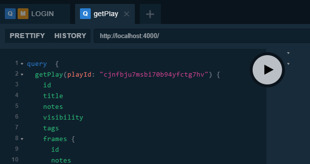
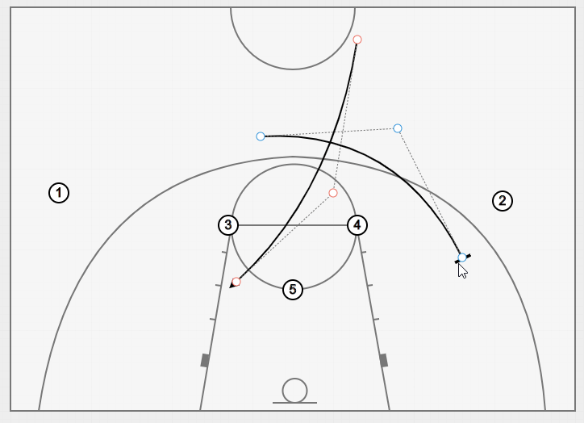
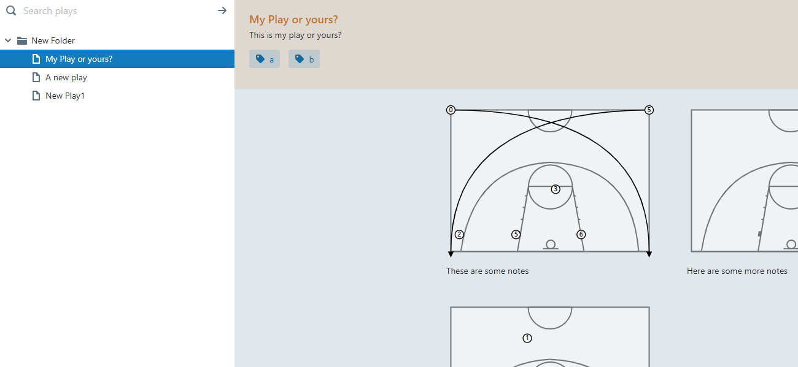

+++
title = "First impressions: converting a React/Firebase project to GraphQL"
description = "I've recently moved a firebase project to GraphQL, here I talk about the my first impressions of migrating to GraphQL."

aliases = ["/first_impressions_converting_a_firebase_project_to_graphql", "/post/first_impressions_converting_a_firebase_project_to_graphql"]

[taxonomies]
tag = ["code"]
+++

I've been working on a project on and off for about 2 years, which I'm using to
create basketball play diagrams. I wanted some real-time features and eventually
settled on firebase for the backend. I found
[react-redux-firebase](https://github.com/prescottprue/react-redux-firebase), a
fantastic project for redux / firebase bindings, and quickly built up a
prototype. I used the app throughout the entire 2017/18 basketball season and
found it very useful for scouting reports, building up training plans and so on.



Then development stalled... the constraints of firebase, the weight of redux
boilerplate and the few idiosyncrasies of the firebase bindings made adding new
features a bit of a drag. The project was usable, but it had enough app-crashing
bugs that I wasn't comfortable sharing it with other coaches.



## What wasn't right about firestore?

Actually, not a whole lot, if I'm honest. Firebase has a very decent free tier,
is easy to get up and running, and has nice built-in support for features like
authentication. I did have a few small frustrations:

1. The security rules that are used for authorisation depend on a custom language which is a bit of a nightmare to develop and especially debug. [firebase-bolt](https://github.com/firebase/bolt) is an improvement over the normal security rule language, but not very well maintained. (in the end with the firestore beta I gave up on security rules for the MVP).
2. Even some seemingly simple tasks like preventing new user sign ups were also
   surprisingly hard to do.
3. I found
   [normalisation](https://redux.js.org/recipes/structuringreducers/normalizingstateshape)
   of data structures well-suited to the redux architecture, but also a pain to
   work with for multi-layered hierarchical documents as it felt like it
   required a lot of additional queries.
4. The bindings were pre `1.0` so there were a few weird bugs [like this
   one](https://github.com/prescottprue/redux-firestore/issues/140) which gave
   me headaches, and were tricky to debug.
5. redux boilerplate :(

## Discovering GraphQL

Coming back to the project after a few months away, I felt like it was time for
a change. While (for now) this is just a hobby project, I wanted to open it up
to a few of my fellow coaches. As some of the issues in the project would
require me to restructure the database, and I felt like the GUI needed a
complete overhaul, I decided to look around for some other options to firebase.

I'd been hearing good things about GraphQL so kind of as a "what if..." I
decided to learn GraphQL while porting the firebase project over.

Initially I settled on a stack of `next.js` and `react-apollo` on the client
(neither of which I had used before), although after a couple of days wrestling
with SSR and file system routing of `next` (and getting annoyed that half their
tutorials are behind a login wall), I ditched `next` in favour of the old
faithful, `create-react-app`.

For the MVP server I chose `prisma` and `graphql-yoga`. So far I've migrated
about 80% of the functionality from the firestore website to the react-apollo
website, and I'm very happy with the approach. I've listed some of the "pros and
cons" I've encountered with GraphQL so far below.

## What I like about GraphQL

### Easy(ish) to learn

I knew absolutely nothing about GraphQL, and initially it looked a little
intimidating, so I did what any self-respecting developer does when they are
lost - I googled. I found [How to GraphQL](https://www.howtographql.com/), which is a really well
laid out tutorial showing you how to create a GraphQL server and client. It only
took a day or so of tinkering before it clicked into place, and I could start
transitioning my firebase app over.

### Writing queries / mutations is very easy

In the front end writing type safe queries is as simple as this:

```graphql
query GET_PLAYS($userId: ID!) {
  getPlays(userId: $userId) {
    id
    title
  }
}
```

The server requires a bit more code, having the query defined a second time in a
`schema.graphql`, and a `resolver` function which converts the query into a response
to the client. A simple resolver in `prisma` might look something like:

```typescript
export const getPlays = async (root, data, context) => {
  return await context.prisma.user({ id: data.userId }).plays()
}
```

Resolvers tend to only do one thing, and are only a few lines long, making them
easy to develop.

### Declarative data / reduced prop-passing in the client

In the client with `react-apollo`, data is queried or changed by wrapping the
React elements in higher order components. A `Query` HOC is used to fetch data and
a `Mutation` HOC can be used to modify or create data. Both use render props to
handle the results of their operation. An (over simplified) example of how a
`Query` would be used is like:

```typescript
// e.g. import { GET_PLAYS } from '../client-schema/get-plays.graphql'

<Query query={GET_PLAYS}>
  {result => result.getPlays.map(item => <Play {...item />)}
</Query>
```

This runs when the component loads, and then allows mapping the returned query
data over components. `react-apollo` also provides cache implementations so you
can optionally display data from local-storage etc _while_ the query is being
returned from the server.

A mutation is also quite simple:

```typescript
<Mutation mutation={UPDATE_NAME} variables={{ name: this.state.newName }}>
  {(mutation) => <button onClick={mutation}>Update Name</button>}
</Mutation>
```

Here the component passes the "mutation" function to its render props which
actually performs the update on the server. You don't need to "marshal" the
arguments in a separate callback, this is done for you by the HOC. (If necessary
you have the option to call the mutation directly like a function)

An advantage of this declarative approach is that I find myself doing a lot less
"prop passing" through the hierarchy. Instead I just define the data
requirements at the point where they are used. This also results in less digging
through files trying to work out where the `onPlayCreated` prop originally came
from.

### Ditching redux

While I've built a few applications using redux and I'm a fan of the flux
approach, I do find myself frustrated by how complicated writing new actions
(especially async ones) can be using redux. I don't think ending up with a chain
of actions like `ON_REQUEST_PLAY`, `ON_REQUEST_PLAY_SUCCESS`,
`ON_REQUEST_PLAY_ERROR`,
and a saga or a thunk all spread across multiple files is anybody's idea of a
good time. I've found that without redux my code is a lot simpler and easier to
understand, while achieving the same level of relatively complex functionality.

### Loading, optimistic-rendering and error states

A really neat feature of react-apollo is the way that it handles loading, error
and "optimistic" UI. Consider the slightly more complex example below:

```typescript
<Query query={GET_PLAYS}>
  {(data, loading, error) => {
    if (loading && !data) return <Spinner />
    if (error) return <Error message={error.message} />
    if (!data) return <NotFound />
    return data.getPlays.map(item => <Play {...item} loading={loading} />)
  })
</Query>
```

This particular implementation shows a loading spinner if the query is
_in-flight_ and there is no cached data. If there is locally cached data, this
will be displayed while the query is running (we can still show a spinner in
this case if we want to). If the request errors, this can be displayed as well,
and all with only a few lines of code using the props passed down from the
`Query` HOC.

We can also control how the local cache is used by specifying a `fetchPolicy`,
for instance `cache-and-network`, `no-cache` and so on which tells
`react-apollo` where to look for data. This makes it very easy to handle real
world scenarios like displaying data quickly, and merging in new data from the
server automagically when it arrives.

Its even neater for mutations, which offer an `optimisticResponse` option. Here
you can pass the UI the value you think will be returned from a `Mutation` which
is stored temporarily in the local cache and displayed in the UI. If the request
errors out the UI is automatically rolled back to the unmodified state, but if
the request is successful it appears to the user that the change has been made
without any latency. (This feature alone solves about three hard to fix issues I
had with updating the `redux-firestore` backend).

### The GraphQL Playground

This is a fantastic tool for developing / testing / getting to know how GraphQL
works.

## What I don't like about GraphQL (and/or Prisma)

Despite all these features, GraphQL certainly isn't perfect. Here are some of
the main issues I've come across:

### Lots of boilerplate and repetition

On the server, there is a lot of boilerplate code. For `prisma` based
applications, developers are encouraged to have a "database layer" and an "API
layer". In the case of prisma this means you are required to maintain your
database schema in three different places:

1. The prisma schema file, which is used to create and migrate the database
   structure
2. prisma client bindings, automatically generated from the schema file
3. a separate (but in many places identical) schema for the `graphql-yoga` back
   end.

In addition to this, each possible query mutation requires a `resolver` to be
written which handles these queries. The schema for the queries is then
replicated client side (with a slightly different format).

While there are some tools to reduce the boilerplate, this is probably the worst
"feature" of GraphQL. I've come across to date.

### Error messages

On the server I've had some issues with [error messages being a bit
vague](https://stackoverflow.com/questions/52883048/could-not-find-argument-in-nested-prisma-graphql-query/52885173),
although part of that issues could just be me getting to grips with how they are
written.

### Hosting

A neat thing about firebase and firestore was how easy it was to set up and
install a back end. It literally takes five seconds to do, and cost $0. I could
also host the front end using firebase hosting and deploy it from a CLI.

The picture for GraphQL is a lot less pretty. There are products like
[graph.cool](https://graph.cool/) and [hasura](https://hasura.io/) which can be
deployed to heroku and a bunch of others that come up in searches but have since
folded. Neither solution really works for me - Prisma cloud hosting starts at
$300 USD a month; I don't understand this value proposition. There are several
other options (i.e. some open source ones, Amazon AppSync etc), but there
appears to be a lot of churn in the smaller providers.

The other option is to "roll your own" backend using docker and a VPS, which is
basically the only option documented by Prisma. Unfortunately Docker is
incompatible with the most common version of Win 10 so this isn't an option. To
be honest part of the reason I initially chose firebase was that I'd rather
spend time getting the front end to a state where I can share the app with
others, as opposed to working on DevOps.

In the end I opted to use a free Prisma Cloud development server as an interim
solution, however this appears to have a very long latency ~1s on requests. I
hope that by the time I'm moving towards "production", some other viable options
have emerged.

> **NOTE FROM AN OLDER AND WISER WILL** I think at this stage I'm looking at
> using an AppSync / Cognito / DynamoDB / Lambda backend, but I may make another
> post later on if I go down that route.
>
> **ANOTHER NOTE FROM AN EVEN OLDER AND WISER WILL** Hey, it turns out I can
> just wrap my firestore DB with a GraphQL endpoint!



## Overall verdict

GraphQL has some annoyances but overall I've really enjoyed building a server
and application with it. There are some frustrations compared to firebase but
overall I'm happier developing with the GraphQL backend as it gives me an almost
_functional_ approach and few surprises.

The client also seems like a lot less of a hassle to work with than mixing redux
and firestore and with the backend fleshed out I'm implementing features a lot
faster than I was with firestore. Many of the issues I had trouble working
around with firebase just aren't issues with the new design.

I'm really excited about building some of the new features I've been dreaming
about for a few years and sharing the app with some other coaches!
