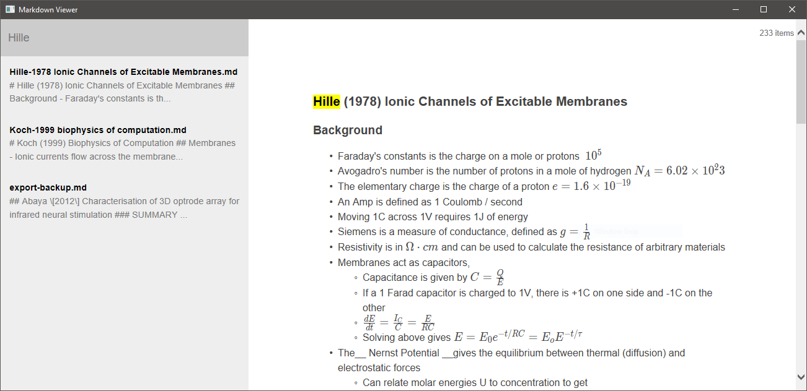

+++
title = "Replacing Electron with C# WebView (Windows Only)"
description = "A brief look at the WebView libraries coming to C# WPF"

aliases = ["/replacing_electron_with_c_sharp_edge_webviews_on_windows", "/post/replacing_electron_with_c_sharp_edge_webviews_on_windows"]

[taxonomies]
tag = ["tutorials", "phd"]
+++

For my PhD I keep notes in Markdown documents of the key papers I've read. I
recently wrote a [simple rust
application](https://github.com/will-hart/markdown-browser/) for searching and
rendering these Markdown documents, which are often quite maths heavy. I find it
very useful when writing things up.



I originally thought about using electron, but was turned off by the large
number of files an installation includes. I don't really have an issue with the
RAM or disk space electron requires, although its become a bit of a meme.
Warning, personal preference: I also much prefer the _look and feel_ of web
based interfaces over most "native" interfaces.

To write the application I used the `WebView` package for Rust, which
unfortunately uses the IE version installed on the computer (IE11 I think).
Writing code for IE and debugging was... challenging? The great thing about Rust
was that it allowed me to build an application that is about 800kb and uses 50MB
of RAM when holding about 300 documents in memory. Having a single application
file was also very nice as it reduced the noise and let me just drop it into the
folder with my notes. On the flip side, I wrote the application in Rust which
was a good learning experience, but required (and requires!) a lot more effort
for me to maintain than something written in JS or C#.

I recently came across a [blog
post](https://docs.microsoft.com/en-au/windows/communitytoolkit/controls/wpf-winforms/webview)
talking about how Microsoft had made Edge available as a [WebView in WPF /
WinForms
apps](https://www.nuget.org/packages/Microsoft.Toolkit.Wpf.UI.Controls.WebView),
where previously it was only available through UWP. Here I'll describe how I
went about creating, bundling and debugging the Markdown browser in a WPF app
built as a single `.exe` file, and using an Edge based WebView (which as we now
know will one day run on Chromium, and should be installed on every Win 10
machine!).

## Installation

I started with a fresh WPF project, and from the package manager console ran:

```bash
  Install-Package Microsoft.Toolkit.Wpf.UI.Controls.WebView -Version 5.0.1
```

Then in my `MainWindow.xaml` I added the namespace

```XML
xmlns:WPF="clr-namespace:Microsoft.Toolkit.Wpf.UI.Controls;assembly=Microsoft.Toolkit.Wpf.UI.Controls.WebView"
```

and added the control inside the default `Grid`

```xml
<WPF:WebView x:Name="WebView" />
```

## Loading a local file

I added a simple `index.html` file to the project under `www/index.html`. I set the build type to `EmbeddedResource`. I hooked up a `Window.Loaded` event which looked like the following:

```cs
// e.g.
// using Microsoft.Toolkit.Win32.UI.Controls.Interop.WinRT;
// using System.Linq;
// using System.Reflection;

private void Window_Loaded(object sender, RoutedEventArgs e)
{
var asm = Assembly.GetExecutingAssembly();
var fileName = asm.GetManifestResourceNames().Single(s => s.EndsWith("index.html"));
string index;

    using (var stream = asm.GetManifestResourceStream(fileName))
    using (var sr = new StreamReader(stream))
    {
        index = sr.ReadToEnd();
    }

    WebView.ScriptNotify += WebView_ScriptNotify;
    WebView.NavigateToString(index);

}
```

This waits until the `window` loads, then reads "index.html" from the embedded
`index.html` file. It then uses the `WebView.NavigateToString` method to load
the string into the embedded `WebView` browser.

The line `WebView.ScriptNotify += WebView_ScriptNotify` adds an event handler so
that the WebView can call into C# code through JavaScript, i.e.

```javascript
window.external.notify("the string to pass to the C# code")
```

## Bundling as a single file

The next task was to try to build a single executable file from the WPF
application. This required a bit of googling, but the best method I came across
was [predictably on StackOverflow](https://stackoverflow.com/a/4995039/233608).
Firstly I closed the solution in VisualStudio and opened the `.csproj` file in
VSCode. I added the following before the last closing tag:

```xml
<Target Name="AfterResolveReferences">
  <ItemGroup>
    <EmbeddedResource Include="@(ReferenceCopyLocalPaths)" Condition="'%(ReferenceCopyLocalPaths.Extension)' == '.dll'">
      <LogicalName>%(ReferenceCopyLocalPaths.DestinationSubDirectory)%(ReferenceCopyLocalPaths.Filename)%(ReferenceCopyLocalPaths.Extension)</LogicalName>
    </EmbeddedResource>
  </ItemGroup>
</Target>
```

I then added a new `Program.cs` file, and added the following code:

```cs
public static class Program
{
[STAThread]
public static void Main()
{
AppDomain.CurrentDomain.AssemblyResolve += OnResolveAssembly;
App.Main();
}

    private static Assembly OnResolveAssembly(object sender, ResolveEventArgs e)
    {
        var thisAssembly = Assembly.GetExecutingAssembly();

        var assemName = new AssemblyName(e.Name);
        var dllName = assemName.Name + ".dll";

        var res = thisAssembly.GetManifestResourceNames().Where(s => s.EndsWith(dllName));
        if (res.Any())
        {
            var resName = res.First();
            using (var stream = thisAssembly.GetManifestResourceStream(resName))
            {
                if (stream == null) return null;
                var block = new byte[stream.Length];
                stream.Read(block, 0, block.Length);
                return Assembly.Load(block);
            }
        }

        return null;
    }

}
```

> **Note** you might want to do some try-catch blocks around the `Assembly.Load`.

After editing the project settings to use `Program.Main` as the entry point, the
whole application was bundled inside the `.exe` file built by VisualStudio!

## Debugging Edge

Finally, for debugging the JavaScript I followed [another blog
post](https://pspdfkit.com/blog/2018/edge-devtools-uwp/) by James Swift. I
downloaded `Microsoft Edge DevTools Preview` from the Microsoft Store, then in
Internet Explorer I had to find `Internet Options > Advanced > Browser` and
uncheck two options:

1. Disable script debugging (Internet Explorer)
2. Disable script debugging (Other)

> **Note** that this is through IE11, not Edge (thanks Microsoft).

After doing this I could start up the DevTools preview and run the application
in VS and use the DevTools to debug the embedded WebView.
