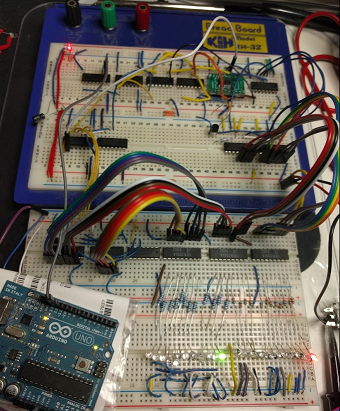
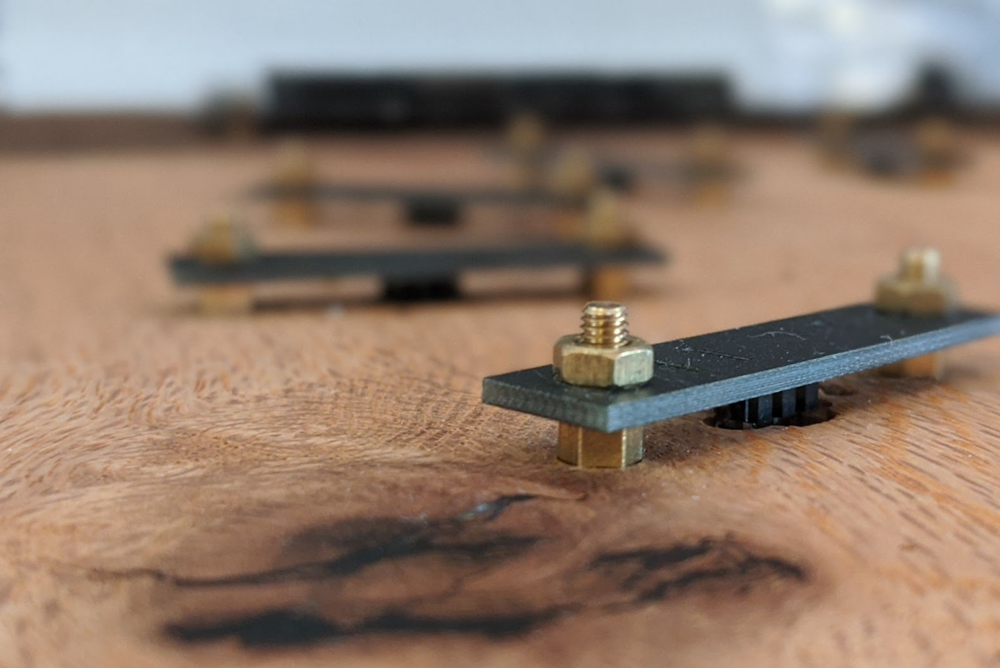
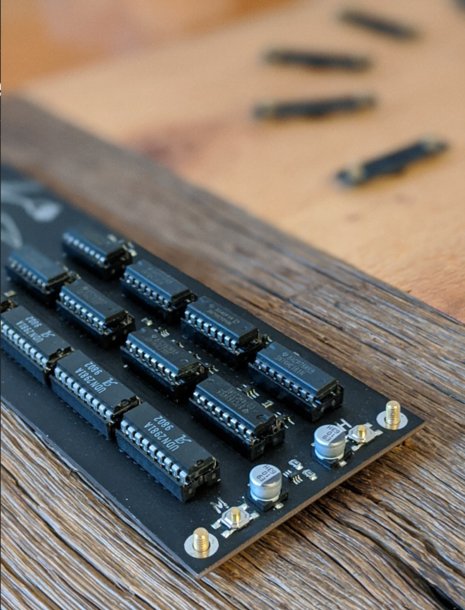
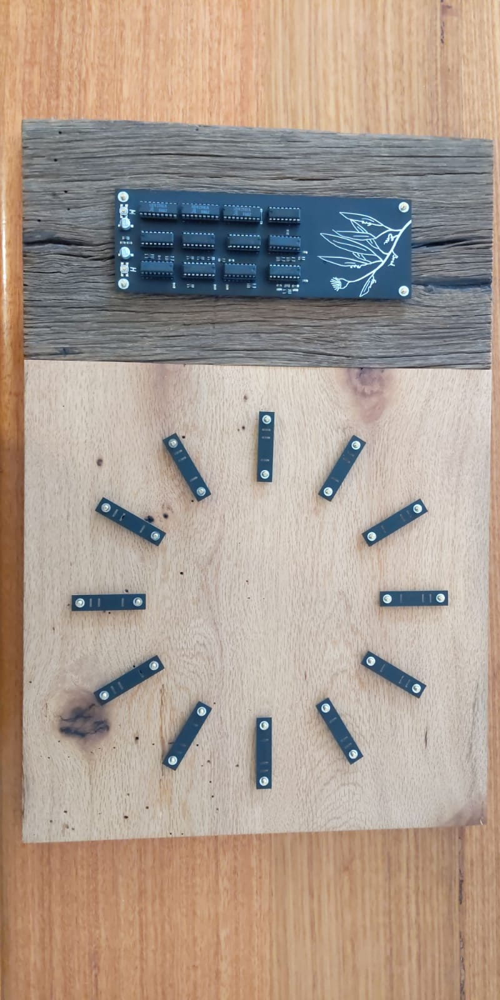
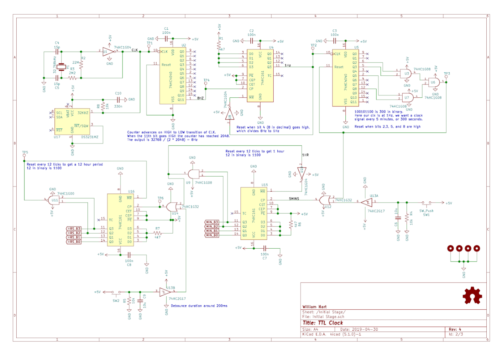
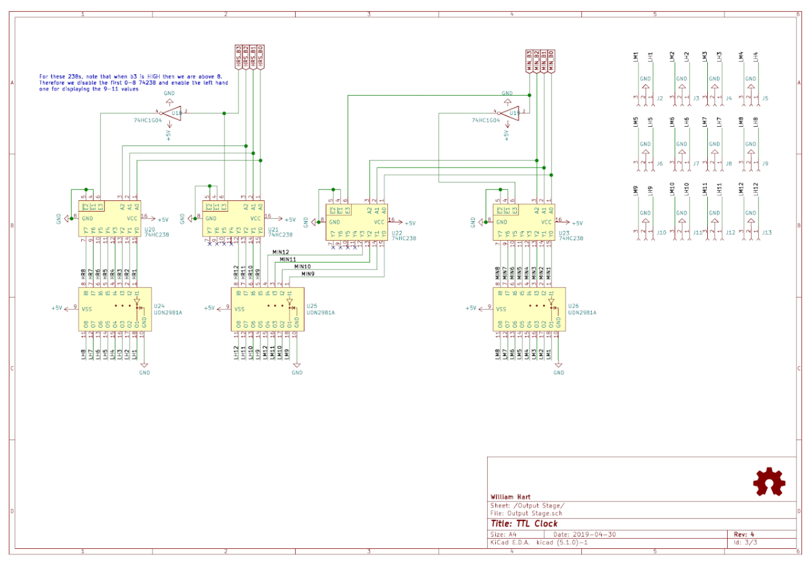

+++
title = "CMOS analog clock"
description = "A custom analog clock using CMOS components and LEDs for the digits"

aliases = ["/20220111_cmos_analog_clock", "/post/20220111_cmos_analog_clock"]

[taxonomies]
tag = ["random", "projects"]
+++

*The purpose of this project was to build a large 30cm by 20cm clock using CMOS electronics driven from a 32kHz crystal. The project was a housewarming gift that arrived about four years too late and several IOUs later.*

I took inspiration from a number of sources for the analog circuitry, but unfortunately most of those links are lost in the mists of time. The basic principle is to take a 32kHz signal and divide it down to the correct signals using analog ICs, mostly a combination of 74HC4040s and 74HC161s mixed with a series of logic gates (the schematics are included below) and then 74HC238s on the outputs. The circuitry was complicated enough that I breadboarded it:

This would have gone a lot better if I'd had an oscilloscope or decent logic probe for debugging, but I developed a system of LEDs logic probes and used the Arduino to inject signals at arbitrary frequencies and got there in the end.

Once the clock circuitry was set, it was time to design the layout itself. I wanted something that combined the blocky, industrial vibe of the analog circuitry with softer, more natural lines of timber. Luckily my Dad is very into furniture making, and was very keen to help out by supplying a piece of French Oak he had spare and as much of his highly specialised woodworking skills as I needed. I came up with a design (supported by my design consultant a.k.a. my Wife) with separate "clock" and "main board" sections, each contrasted by rough and clean cuts of the oak.

The digits were small circuit boards mounted on brass standoffs with the cables drilled through the oak. There were twelve, to display 1 hour and 5 minute intervals using LEDs that were mounted on the back of the digit board and shone through slots. Having only a five minute tick may be a detractor for some, but this is as much a piece of wall art as it is a Swiss timepiece and it makes actually building the circuitry somewhat feasible.

The main board contained all the clock logic, with the ICs mounted in "industrial" rows, with as much many of the traces as possible routed on the back. At the other end to the ICs was a simple eucalpyt design I drew in inkscape and cut out of the solder mask in Kicad.

Overall I'm pleased with the design of the clock, and I like the contrast between the electronics and the timber.

## What I learned

The clock took about three years longer to complete than I'd planned. Partly this was doing the work while spending basically every waking moment working on my PhD, but partly I ran into a few snags that blocked me while I came up with a solution. Overall I feel like I learned an awful lot about analog circuitry, packaging and the challenges of creating a (hopefully) visually appealing but functional PCB design.

The main issues were around routing the cables on the back and having proper connectors that would secure the cables from the back of the main board to the digits. Each digit required a ground and two signal cables, and for some reason I struggled to find appropriate "JST" connectors when I first built the boards. I then spent an awful lot of time playing around with adapter boards, weird pin header connectors and ribbon cables to get some solid connections, before I finally found some premade 3-pin JST cables and SMD headers off ebay.

I also had some issues with assembling the main PCBs. Some of the smaller logic chips were at the limit of my hand soldering ability, and I didn't yet have a proper heat gun. The board was a bit too large for my regular home reflow methods. This meant a few reworks before I got it right. Luckily as the most expensive components were in the DIP sockets, there wasn't much wastage in terms of ICs.

This was a very satisfying project to finish up, and not pictured is a CNC cut and laser engraved back plate to guide and constrain the cables on the back. This project was stressful at times, and holds the dubious record of being the only thing that has ever given me an instantaneous migraine!

## Schematics

Below are images of the schematics for the clock circuitry.

> Right click and save as or open in a new tab for *slightly* higher resolution.

