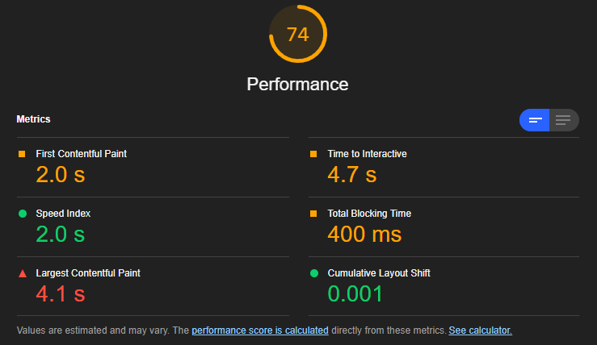
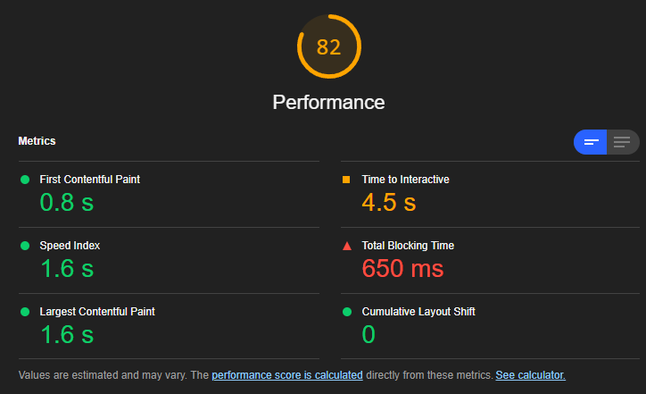
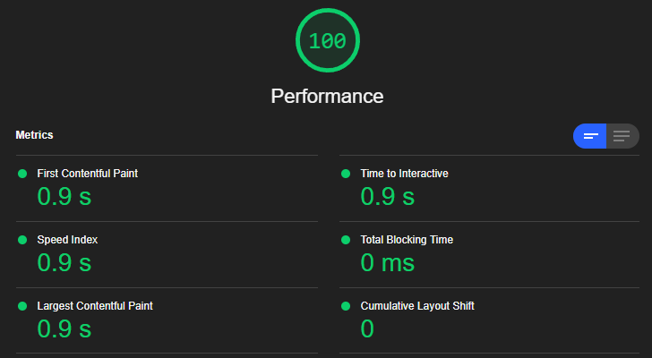

+++
title = "Optimising time to interactive, or rewriting my blog... again"
description = "What started out as experimenting with reducing the time to interactive resulted in me rewriting the blog... again. This time I've migrated to Zola."

[taxonomies]
tag = ["code", "random"]
+++

I seem to have a habit of rewriting this blog every time I get bored, but this time I swear I didn't do it on purpose! On the plus side, rewriting the blog is a good way to try out new things and different deployment strategies. On the negative side, it often takes over a weekend and I don't get much else done!

Over time I've evolved from [a custom static site generator](@/post/2014-03-18_a_simple_static_site_generator_in_python.md), to a [self-hosted ghost instance](@/post/2015-04-27_switched_to_ghost.md), then most recently to [next.js](@/post/2020-12-28_recreating_the_blog_in_nextjs.md).

## It started with lighthouse

I posted about my [CMOS analog clock](@/post/2022-01-11_cmos_analog_clock.md) the other day and on a whim I ran a [lighthouse](https://developers.google.com/web/tools/lighthouse) report on the site. I was surprised to see this in "mobile" mode:

The "time to interactive" in particular was a bit of a surprise. On desktop its about 1s, but here its approximately a thousand years. One of the strengths of NextJS is how easy it makes it to do server side rendering (SSR) and server side generation (SSG). I'd spent quite a lot of time messing about with SSG and built it into a custom markdown to SSG pipeline in NextJS. Lighthouse seemed to suggest that bundle size was the big issue. I ran the profiler quickly and I'm definitely not an expert, but with simulating a "Fast 3G" connection and "4x CPU slowdown" the best I could tell was it spent about 3 seconds loading the bundle and another 2 seconds rendering.

I tried a few different things to reduce bundle size, including [replacing some CSS](https://github.com/will-hart/willhart.io/commit/af7a0097881aaa3feea5d103c6a547088d28a61c) and [dynamically loading components](https://github.com/will-hart/willhart.io/commit/f302453b4030be5227201a8d7d6c2a521c57d4ab) but nothing really made a dent. [Using Next's image optimisation](https://github.com/will-hart/willhart.io/commit/3097e3fe11f8dc1d5aee51e714daeea8946b2151) was more successful and seemed to make a huge difference to the bandwidth for more image heavy posts, but time to interactive was still fairly low.

These seemed to make a bit of difference in some respects, in particular I think Next's image optimisation was making a huge difference. Overall time to interactive was still about 4-5 seconds probably due to a decent sized JS bundle and the time spent spinning up the javascript.

## Looking at Zola

I decided to run a quick proof-of-concept to compare to a pure static site generator. I chose [zola](https://getzola.com), which is a rust-based static site generator that is quite straighforward to use. Like most rust things, speed seems to be a big consideration and builds are definitely very speedy (this site takes about 300-500ms to build from scratch).

To get started without setting up an entire pipeline, I copied the minified CSS from the NextJS production site and quickly converted a few markdown articles to the Zola format (mostly just changing the front matter to `TOML`). The lighthouse report for Zola was green across the board.

The Zola page definitely renders a lot faster, which is a combination of smaller bundle size and not having to spin up the NextJS javascript on the client side. However looking at total downloads things get a bit more interesting. The table below shows the total download size (in MB) for two posts, one very image heavy and one text/code heavy.

|                | NextJS Unoptimised | NextJS Optimised | Zola     |
|----------------|--------------------|------------------|----------|
| CMOS Clock     | 4.6 MB             | 2.1 MB           | 4.1 MB   |
| NextJS rewrite | 1 MB               | 1 MB             | 0.006 MB |

Zola absolutely smashes NextJS on text heavy pages, but gets beaten on image-heavy pages thanks to Next's image optimisation. Zola does have some support for [optimising images](https://www.getzola.org/documentation/content/image-processing/) which might be useful in closing the gap.

## Did it make a difference?

Overall I think the Zola website will load and become interactive much faster, but without some serious image optimisation it might not have much benefit for more image-heavy posts. NextJS is a fantastic framework, but in this case where I don't really need interactivity and I just want to serve HTML blog pages, then I'll be migrating to Zola.
