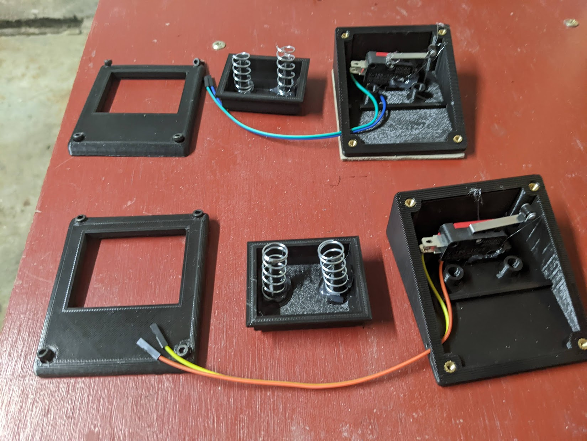

+++
title = "Custom gaming foot pedals"
description = "I created a set of custom gaming foot pedals, basically because I had nothing better to do while in Covid isolation!"

[taxonomies]
tag = ["project", "electronics"]
+++

While playing a certain online shooter with some friends, one of our party noted
that having some foot pedals to lean would make it easier than using the default
Q and E keys. We found a bunch of commercial ones online, with prices from about
$50 to $350 after shipping (electronics and shipping to Australia tend to be
pretty expensive). One of my side projects at the moment is to build my own
mechanical keyboard from scratch, and thinking about it I was almost certain I
had everything I needed on hand to make a set of my own custom pedals.

The idea was simple - grab a couple of limit switches I had for upgrading my
budget CNC, wire them up with a microcontroller with USB HID capability and make
a little custom keyboard that could only press Q or E. The only thing I needed
to buy were springs, as I didn't have any suitable ones in my random stash of
salvaged mechanical pieces. These were about $3 from the local big box hardware
store.

The design was otherwise fairly simple. The main structure was a box with an
angled top, and a hole for the foot button to poke through. A skirt on the
button prevents it from popping out the top, and two springs keep the pedal up
off the switch and provide some resistance. The limit switch is hot glued down
onto a raised base which limits the travel of the foot pedal, and M3 bolts in
heat set threaded inserts were used to fix the two halves together and lock the
"button" in place.

The electronics are equally simple, I had a stash of "blue pill" STM32F103C8
chips, which can be programmed through the Arduino environment. Its a bit of a
hassle because programming requires an external FTDI adapter and manually moving
jumpers around, but once I got the process sorted out it was easy enough. By
putting the GPIO pins into `INPUT_PULLUP` mode, I could also avoid any external
components and just wire the limit switches between the GPIO pins and ground.

Using the inbuilt `USBComposite` library for STM32 chips, the firmware was also
pretty trivial. I've included the gist below. (I'm fairly certain as well that
later on I could provide a two way USB Serial interface to rebind the keys).

## Results

The results were pretty satisfactory, and I can now lean left and right with my
feet while keeping my hands on the WASD keys - its truly a fantastic age to be a
nerd with a tiny home workshop! My friends have both placed orders but I'm not
sure I want to ship them rev 1. I can think of a number of mechanical
improvements I could make, and its hard to resist making custom electronics.

I'd be curious to try other switches, for instance I've got some spare MX Browns
from a mechanical keyboard I'm building that might be interesting to test. I
could even make my own <a
href="https://hackaday.com/2022/01/17/3d-printed-magnetic-switches-promise-truly-custom-keyboards/"
target="_blank" rel="noopener noreferrer">magnetic mechanical switches</a>!

I'm also looking into removing the springs and replacing them with mechanical
flexures (assuming they last long enough to be useful). This would also allow
combining the button and lid into one part which would make manufacturing and
assembly easier.

Either way, it was a fairly trivial and fun project - but very satisfying to
play with.

## Firmware

