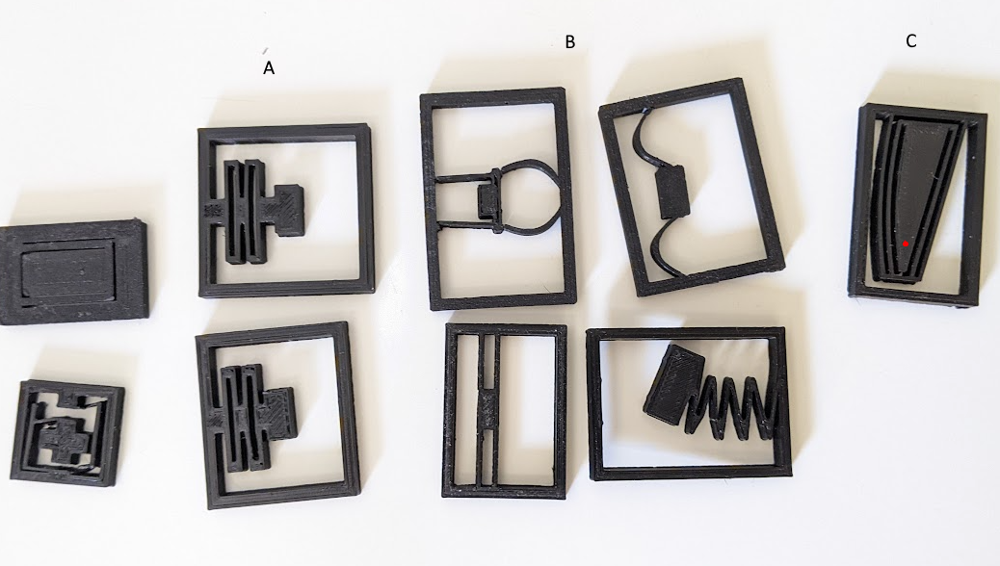
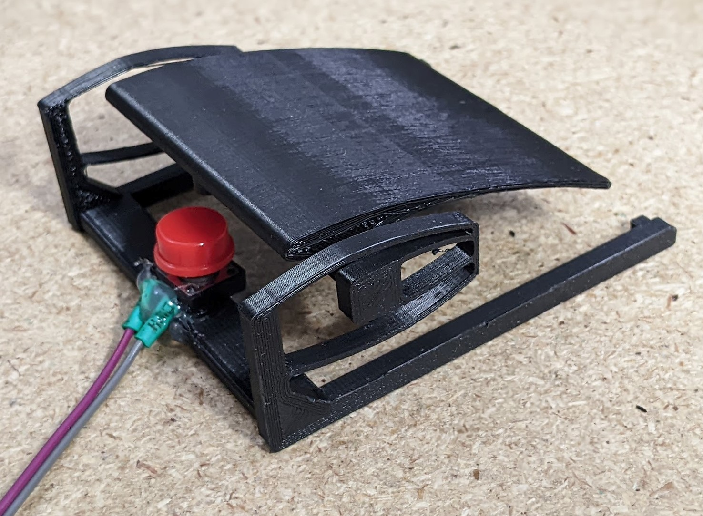

+++
title = "3D printed flexure foot pedal"
description = "Designing a one-piece 3d printed foot pedal using mechanical flexures"

[taxonomies]
tag = ["project", "electronics"]

+++

Following on from my [previous post](/post/custom-gaming-foot-pedals)
on some custom foot pedals I designed, I decided to try simplifying the design
using 3D printed mechanical flexures in the place of the three part design with
springs. This provided to be surprisingly easy to do, although I did play around
a lot with different types of flexures to find a design I was happy with, mostly
inspired by [several](https://hackaday.com/2021/06/22/print-your-own-flexures/)
[posts](https://hackaday.com/2021/12/14/fabulous-flexure-mechanism-makes-for-resetting-cat-calendar/)
on hackaday and one timely youtube video about [mirror actuators on the James
Webb telescope](https://www.youtube.com/watch?v=5MxH1sfJLBQ).

I also had to experiment with what the printer could handle, and what sort of
thickenss and joints were required to make sure the plastic didn't snap when
actuated. Giving the flexures to my kids to play with was a great way to stress
test them! I wanted about 10mm of movement and so designing the flexure in a way
that it stayed out of its own way was part of the challenge. The designs I tried
are below, each is about 40mm x 30mm, and some of them are missing a few pieces.
(As a side effect these proved to be great little fidget pieces for long zoom
meetings.)

The left most designs were just test runs to work out the width of cuts and
beams that my printer and the PLA material could support. The two designs below
"A" were good at deflecting but tended to permanently deform. The designs under
"B" had similar issues. In the end I want with a variation on the "C" design,
this easily deflected 10mm at the end of the beam and reliably returned to its
original shape.

The next step was to translate the flexure into a workable design. In this case
it was also relatively straightforward. From design "C" in the image above, the
outer rectangular frame would be the main body of the pedal, while the pedal
button itself would be attached where the red dot is on the image.

To act as a button, I just hot glued a tactile switch with a nice red switch cap
on it to the frame of the pedal. An interesting feature about this design is
that the pedal moves very easily when I place my foot on it, but it requires
quite a positive force to depress the switch. The switch itself has a nice
tactile click when it is pressed. A side-effect of this design is that its very
digital, i.e. in its current form it probably couldn't be used to provide an
analog signal, while the previous spring-driven design would be much more suited
to that use case. It also requires quite a lot of support material when
printing, which seems a bit wasteful and probably increases the risk of damage
to the pedal while removing it.

It seems pretty durable in "normal" operation, but I'm not sure how it would go
if loaded up with excessive force. Overall I think the feel of the pedal is
nicer and a lot simpler, but I'm not sure if this is the design I'll "mass
produce" for my mates. I do like this clicky tactile switch more than the limit
switches I used on my previous design so I might end up somewhere in the middle
for the final "rev 3" design.
