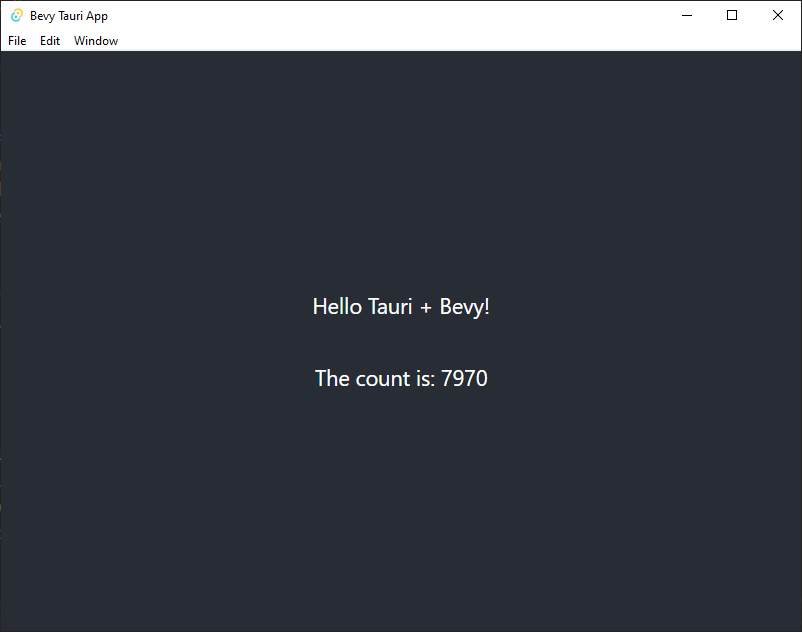

+++
title = "Headless bevy in a tauri app"
description = "Use the bevy game engine as a headless backend for a tauri app, for fun and lols"

[taxonomies]
tag = ["code", "gamedev"]

+++

I want to say right from that start that I'm pretty sure what I'm about to do is
a terrible idea. But given [tauri](https://tauri.studio) just reached 1.0 and
it's been a while since I've done anything in [bevy](https://bevyengine.org/),
the idea occurred to me that there just *must* be some way to combine these two
lovely rust thingies.

So here it is, my misguided, inappropriate and entirely pointless attempt at
using bevy as a backend for a tauri app, despite the fact that bevy already
works perfectly well in web assembly or using its own cross-platform windowing
solution. Sue me.

> If you don't already know, tauri is a very lightweight and rusty alternative
> to electron, and bevy is a data-driven ECS rust game engine that I'm very much
> a fan of. I'll skip the intros - if you want to know more follow the links
> above.

> The code for this article is available [on
> github](https://github.com/will-hart/tauri-plus-bevy)

## Creating a tauri app

I've already blogged about building a simple tauri app,  [part 1 can be found
here](/post/20210826_tauri_create_react_app_tutorial_part1), but since then
things have improved even further and we can get up and running with basically
one command. After making sure my environment is [setup for
tauri](https://tauri.app/v1/guides/getting-started/prerequisites), we can run

```bash
yarn create tauri-app
```

After following the prompts, and selecting the following options:

1. A `create-vite` app,
2. Select `Y` to adding `@tauri-apps/api`
3. Selecting `react-ts` as the library

we need to wait a bit for all the dependencies to install. Now if we run `yarn
tauri dev` and wait a bit (it takes a while the first time while the tauri/rust
code compiles), we can see a basic tauri app up and running. Easy!


## Setting up bevy

In this case we're going to use the `react` front end to render the bevy app, so
we want to run bevy in `headless` mode. Bevy has great examples, and we're going
to borrow heavily from the [headless
example](https://github.com/bevyengine/bevy/blob/latest/examples/app/headless.rs)
in the bevy repo.

Firstly we add the bevy dependency to the tauri project, skipping default
features to remove windowing and rendering. In `src-tauri/cargo.toml` add a few
dependencies:

```rust
bevy = { version = "0.7", default-features = false }
crossbeam-channel = "0.5"
```

Then in `src-tarui/main.rs` we want to initialise the bevy app:

```rust
// required imports:
use bevy::{app::ScheduleRunnerSettings, prelude::*, utils::Duration};

// at the start of fn main():
App::new()
    .insert_resource(ScheduleRunnerSettings::run_loop(Duration::from_secs_f64(
        1.0 / 15.0,
    )))
    .add_plugins(MinimalPlugins)
    .run();
```

> **NOTE** I find that the `src-tauri/main.rs` line has an error about missing
> `distDir` which goes away if I build the front end app using `yarn build`.

You'll note that we've made a few changes from the example - we've set it to run
at 15fps, and removed the "counter" system from the example (we'll get back to
it though).

Now if we run `yarn tauri dev` there is a problem - nothing happens! This is
because the bevy `run()` function is "blocking", and never exits, but as we dont
have a windowing or rendering library nothing is changed. Remove the `run()`
call at the end of the bevy App::new() line, tauri automatically recompiles the
app and the window appears which confirms this is the case. Ok, so we need a bit
more thinking here, we need to run the bevy app in the background in a
non-blocking way - enter threads!

## Using separate threads for bevy and tauri

Looks like we need to spawn the bevy app on a separate thread. There is a pretty
[good example of that here](https://github.com/bevyengine/bevy/discussions/1150)
and in [this official
examples](https://github.com/bevyengine/bevy/blob/latest/examples/async_tasks/external_source_external_thread.rs),
so lets adapt those.

We start by using `std::thread` and `spawning` a new thread for the bevy app. We
can also add the `run()` call back in. The bevy part of the code at the start of
`src-tauri/main.rs` now looks like this:

```rust
// add: use std::thread;

thread::spawn(move || {
    App::new()
        .insert_resource(ScheduleRunnerSettings::run_loop(Duration::from_secs_f64(
            1.0 / 60.0,
        )))
        .add_plugins(MinimalPlugins)
        .run()
});
```

Things load, but now its not particularly useful - the app is running in a
separate thread but we don't have any way to communicate between the bevy and
tauri apps. Rust has a whole lot of channels that can help with this. Here we
want to be able to send from lots of producers on the bevy side, but only one
receiver - the tauri app, so a "multi producer single consumer" or `mpsc` queue
seems like the right idea.

In `src-tauri/main.rs` we first create the channel, setting the type just as a
number for now. We use crossbeam because as the `Receiver` is `Sync` we can more
easily pass it to tauri:

```rust
// add: use crossbeam_channel::{bounded, Receiver, Sender};

let (tx, rx) = bounded::<u32>(1000);
```

> **NOTE** the use of bounded here sets a fixed size to the number of messages
> that can be queued up in the channel. This means if we don't receive the
> messages in the tauri app then eventually the channel will fill up. This
> causes any senders to block until there is space on the channel to send their
> message - this could potentially lock up the bevy app.
>
> Alternatively, we could use an `unbounded` channel, which has no capacity.
> Whilst we arne't likely to allocate enough `u32`s to fill up my memory in a
> hurry, I'll leave this is a bounded channel.

This line gives us a sender / transmitter (`tx`) and a receiver (`rx`). We can
clone the sender as often as we want and its thread-safe, but we can only have
one receiver, which we will pass to the tauri app. Start by creating a new
struct to hold the `Sender` in `src-tauri/main.rs`:

```rust
struct TauriBridge(Sender<u32>);
struct BevyBridge(Receiver<u32>);
```

Update the app build section in `src-tauri/main.rs`, before `run()` to add the
`TauriBridge` into the bevy app:

```rust
App::new()
  // ...
  .insert_resource(TauriBridge(tx))
  .run();
```

Lets create a basic bevy system that increments a `u32` counter every frame and
sends a message via the channel with the new counter value. First we'll create a
resource to hold the current value in `src-tauri/main.rs`:

```rust
#[derive(Default)]
struct CounterValue(u32);
```

We derive `Default` so its easier to use this as `Local` state for the system
that increments the counter. The system is quite straightforward and can be
mostly derived from the "headless" bevy example. We are using a global resource
rather than the `Local` resource in the example so we can access it from other
systems.

```rust
fn increment_counter(mut state: ResMut<CounterValue>) {
    state.0 = (state.0 + 1) % 1_000_000u32;
}
```

We should also create a system that sends the counter to the mpsc channel on
each frame.

```rust
fn send_counter(tauri_bridge: ResMut<TauriBridge>, counter: Res<CounterValue>) {
    tauri_bridge
        .0
        .send(counter.0)
        .expect("Failed to send on channel");
}
```

We then need to add the `CounterValue` resource to the bevy app, plus the two
systems. That looks like this in `src-tauri/main.rs`:

```rust
  // ...
  .insert_resource(CounterValue::default())
  // ...
  .add_system(increment_counter)
  .add_system(send_counter)
  // ...
```

## Pulling data from bevy via the front-end

> **NOTE** I end up undoing most of the code in this section. I've kept it [on a
> branch of the
> repo](https://github.com/will-hart/tauri-plus-bevy/tree/feature/frontend-pull-updates)
> if you are interested.

We then want to pass the receiver to the tauri app. We can do this using
[managed
state](https://tauri.app/v1/guides/features/command#accessing-managed-state) and
the `BevyBridge` struct we declared above. Modify `src-tauri/main.rs` where we
declare the tauri app:

```rust
tauri::Builder::default()
  .manage(BevyBridge(rx))
  /// ...
```

> **NOTE** if we used `std::sync::mpsc` here instead of
> `crossbeam_channel::bounded`, we'd have an error here. Tauri needs its managed
> state to be `Send + Sync` and the `Receiver` in `std` is `!Sync`. Using a
> `Mutex` might help here but it seems easier to use a package where this is
> handled by default.

Now seems like a good time to check that bevy is properly sending messages
through to tauri. We're left with a bit of a question - should bevy and tauri
*push* the updates to the front end, or should the front-end pull them by
querying for the current application state? For now lets try pulling updates
when the application is ready.

In `src/App.tsx` we'll modify the app so that we `invoke` a tauri command (that
we haven't yet implemented) to get updated state (i.e. the current counter
value). After we're done, the app should look like this:

```typescript
function App() {
  const [count, setCount] = useState(0);

  // import { useInterval } from 'usehooks-ts'
  useInterval(async () => {
    setCount(await invoke("get_state"));
  }, 1000);

  return (
    <div className="App">
      <header className="App-header">
        <p>Hello Tauri + Bevy!</p>
        <p>The count is: {count}</p>
      </header>
    </div>
  );
}
```

We've added the `usehooks-ts` package just to make things easier (`yarn add
usehooks-ts`). Other than that, we've replaced the default button that
`create-vite` adds and added a call to `invoke` the `get_state` command.

We need to implement this command in the tauri code. In `src-tauri/main.rs` we
need to add a `get_state` command:

```rust
#[tauri::command]
fn get_state(state: tauri::State<BevyBridge>) -> u32 {
    state.0.try_iter().last().unwrap_or(0)
}
```

This just reads the messages on the `bounded` queue and returns the last one. We
also need to add the command to the tauri app,

```rust
tauri::Builder::default()
  // ...
  .invoke_handler(tauri::generate_handler![get_state])
  // ...
```

If we now run the app we should see everything working as expected - the counter
updates based on the bevy state!



## Pushing updates from bevy to tauri to react

What about we try to push updates? To do this we can use use tauri's
[events](https://tauri.app/v1/guides/features/events) to trigger an update on
the client-side. To spawn events periodically, we can use a thread that checks
the mpsc queue periodically and raises an event with the latest value.

We can do this in the `setup` function in the tauri app builder in
`src-tauri/main.rs`:

```rust
tauri::Builder::default()
  // ...
  .setup(|app| {
      let window = app.get_window("main").unwrap();

      tauri::async_runtime::spawn(async move {
          loop {
              match rx.try_iter().last() {
                  Some(payload) => {
                      window
                          .emit("send_state", payload)
                          .expect("Event should be sent");
                  }
                  _ => {}
              }

              // do once a second
              thread::sleep(Duration::from_millis(50));
          }
      });

      Ok(())
  })
  // ...
```

This is quite a bit of code, but its similar to the command we had before - we
spawn a thread that checks the last item on the queue, and if there is something
it emits a `send_state` event on the main window. We can also remove the command
definition and the `invoke_handler` part of the tauri app builder.

In `src/App.tsx` we need to update the function so that we no longer `invoke`
the command, but instead should subscribe to the `send_state` event sent by the
thread we just spawned. Again this is a bit of code but otherwise
straightforward - most of the code is to safely unsubcribe from events event
after the app is unmounted:

```typescript
useEffect(() => {
    let unlisten: UnlistenFn | undefined = undefined;
    listen("send_state", (event) => {
      setCount(event.payload as number);
    }).then((r) => (unlisten = r));

    return () => {
      if (unlisten) unlisten();
    };
  }, []);
```

Running the app now should perform the same as before, the counter ... counts!

## Sending commands back to bevy

This is all well and good, but if we want to make something interactive then
ideally we'd be able to send input back to the app. To see how this might work
we can create a "reset" command which zeroes out the counter. Unfortunately our
current channel is setup for sending the counter from bevy to tauri, so here
we're going to need to send data the other way.

Let's take the opportunity to refactor our channels and the `TauriBridge`
struct:

```rust
// the struct adds a Receiver<()> field
struct TauriBridge(Sender<u32>, Receiver<()>);

// now we instantiate two channels, and name them appropriately.
// we can also set the `u32` typed channel as unbounded and the other
// channel as bounded with size 1
let (tx_to_tauri, rx_from_bevy) = unbounded::<u32>();
let (tx_to_bevy, rx_from_tauri) = bounded::<()>(1);

// in our bevy app building code we need to update the struct declaration too
  .insert_resource(TauriBridge(tx_to_tauri, rx_from_tauri))
```

Next we need to add the `tx_to_bevy` end of the channel as part of `State` in
the tauri app. We already did this when we tried pulling updates in the client
side, so there isn't anything new here. We create a struct and call `manage` on
the tauri app builder.

```rust
// struct declaration
struct BevyBridge(Sender<()>);

// add as state in the tauri app builder
  .manage(BevyBridge(tx_to_bevy))
```

Now we can create a command that sends an empty message to bevy to reset the
counter. We will use `send` rather than `try_send` because I don't really care
about blocking if the queue is full:

```rust
#[tauri::command]
fn reset_counter(state: tauri::State<BevyBridge>) {
    state
        .0
        .send(())
        .expect("Unable to send reset message to bevy");
}
```

We should also add this command in an `invoke_handler` on the tauri app builder
as we did previously.

```rust
.invoke_handler(tauri::generate_handler![reset_counter])
```

We have two more tasks - we need to add a bevy system to listen for the
messages, and add some UI in the front end to call the command.

We'll start with the front end. In `src/App.tsx`, below the counter add a button
and the handler calls `invoke` to run the command:

```typescript
<button
  onClick={() => {
    invoke("reset_counter");
  }}
>
  Reset
</button>
```

Clicking this button once works, but maybe avoid clicking it a second time for
now because it freezes the entire app. This is a results of us using a bounded
queue with size 1, and `send` instead of `try_send` (*shrugs in
blog-post-that-is-getting-too-long-already*).

Ok, before we freeze up the app again, lets add the bevy system that handles
these requests. Actually, I'm getting super lazy, lets just add it to the
`send_counter` system, please don't hate me. To do this we need to change the
function signature in `src-tauri/main.rs`:

```rust
fn send_counter(tauri_bridge: ResMut<TauriBridge>, mut counter: ResMut<CounterValue>) 
```

We then just need to check the receiver queue for any reset messages. At the
bottom of the `send_counter` function, add:

```rust
match tauri_bridge.1.try_recv() {
    Ok(_) => counter.0 = 0,
    _ => {}
}
```

Now hitting the "reset" button in the app causes the counter to go back to 0. I
guess in reality somebody could tap at like 500 clicks per second and fill up
the queue, resulting in some slightly weird jerkiness in the counter. We can
mitigate most of this by just adding a few extra items to the queue capacity:

```rust
// used  to be 1
let (tx_to_bevy, rx_from_tauri) = bounded::<()>(5);
```

## In conclusion

I'm not sure why I did this, really. It seemed like an intersting idea and it
kind of "worked" but wow this involves a lot of code. I'm sure there would be a
better way to do this if I stopped and thought, who knows, maybe then I'd also
be able to think of some reasons why this would be a good idea!

The code for this is available [on github](https://github.com/will-hart/tauri-plus-bevy)
