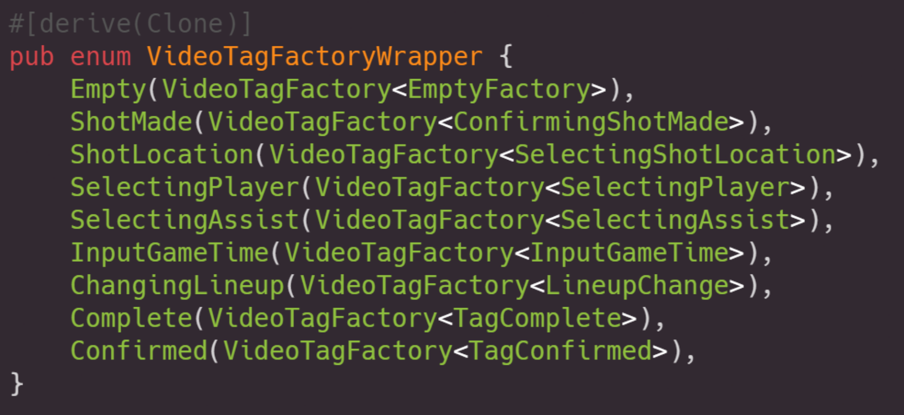
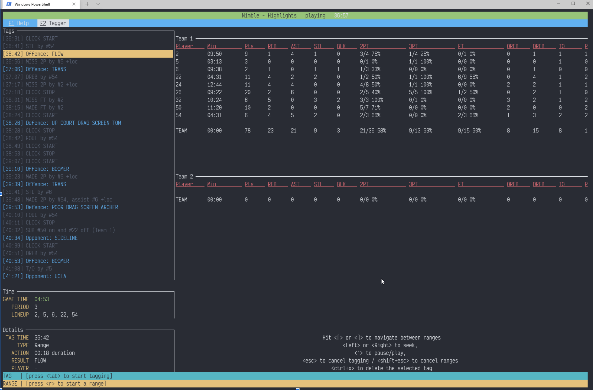
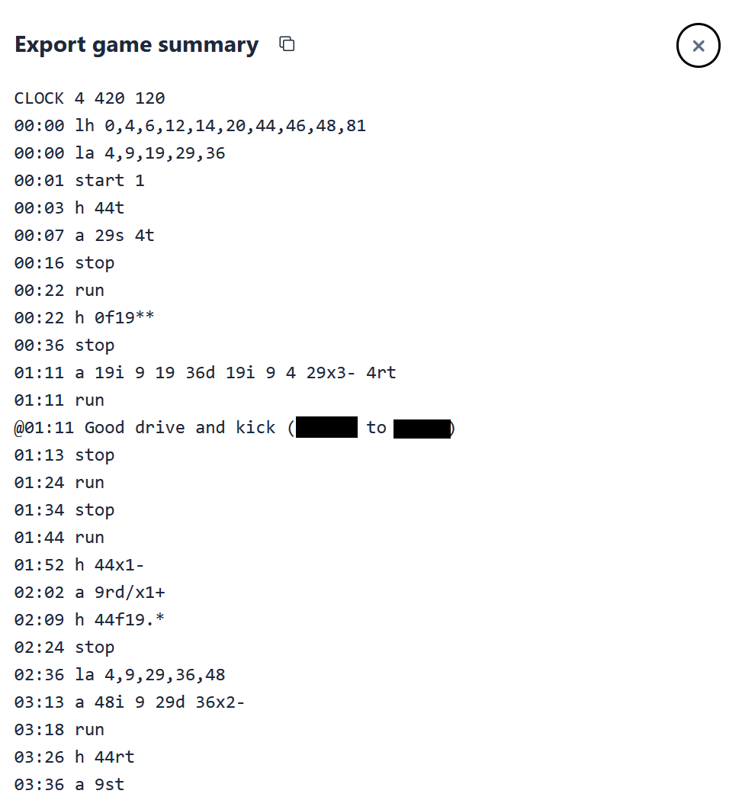
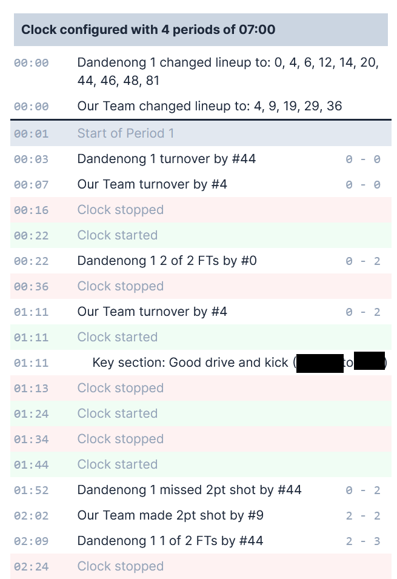
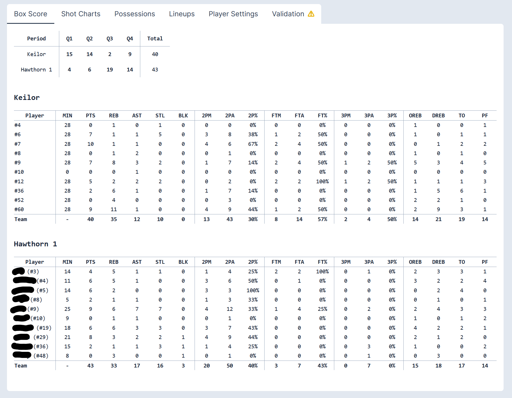
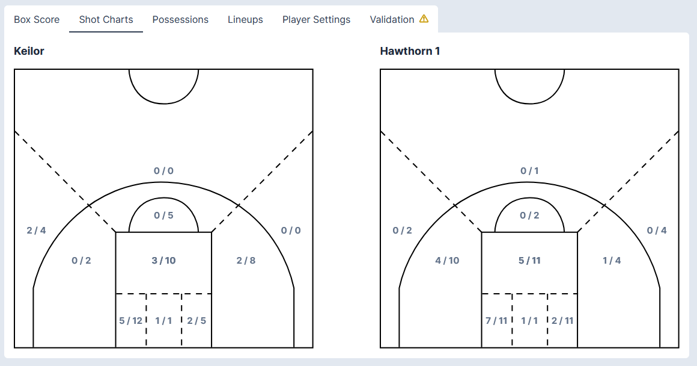
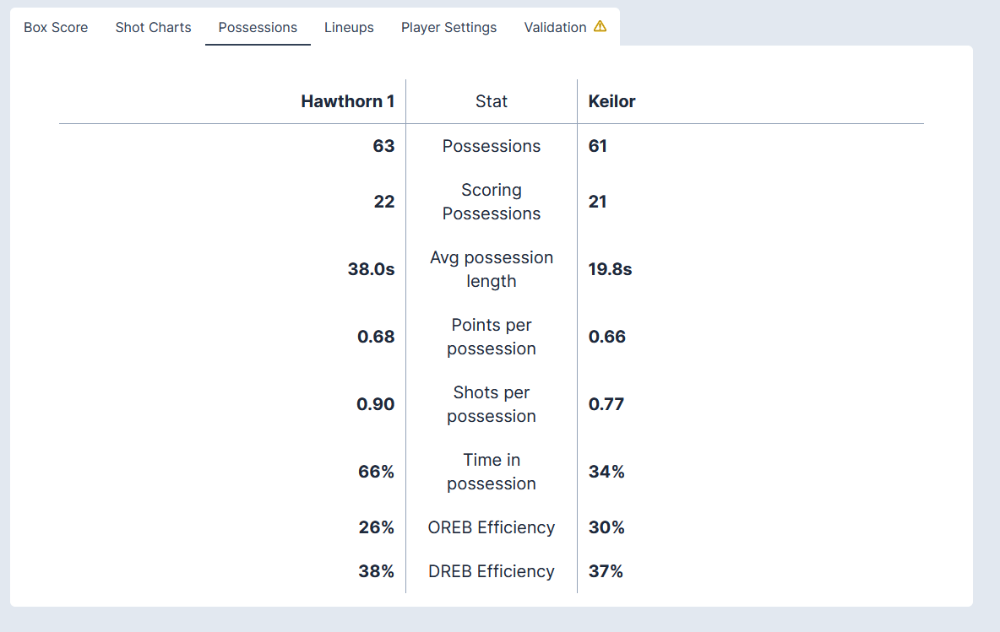

+++
title = "Building a basketball video analysis software tool"
description = ""

[taxonomies]
tag = ["random", "projects"]
+++

> This is a super long article discussing a tool that has been on my mind for at
> least eight years. I'm probably the only one interested in these details, but
> it is satisfying for me to document this project as I'm unlikely to release
> the source code and it seems my work on the project is coming to an end.

In fiction writing, there is a saying - "show don't tell". I think this is also
a great phrase to apply as a youth sports coach. I've been coaching junior
basketball for about 25 years now at various levels. Over that time I've
noticed a big increase in the level of professionalism and the technical
expertise of coaches.

For instance, twenty years ago video analysis was very rare, but these days
analysing game film with the team can be done routinely, even at the youngest
levels of representative basketball. All our games are now filmed and available
on Youtube or other services. Video analysis is a fantastic tool as a coach to
both highlight areas for improvement and show where players are doing things
well. Often a message only really sinks in for players when they see the
examples (both positive and negative) in game film.

I previously posted about my [basketball diagram
software](/post/first-impressions-converting-a-firebase-project-to-graphql)
which I used to write training plans, do scouting reports and diagram plays. In
addition to this tool, I've also spent over eight years slowly building a tool
for video analysis, similar to tools from hudl or Catapult. I'm going to
describe a little bit about this tool and how I built it in this post.

## Defining the "product"

I'm a volunteer coach with my own job and family, and so in addition to having
limited training time, I also want to spend as little time as possible preparing
for video analysis (Yes, I'm aware that I probably spent hundreds of hours
building a software tool to save me minutes of effort). 

So about eight years ago I began to develop a software tool that would:

- let me watch a game film (preferably at 1.5x speed),
- "tag up" key plays with text, or as specific "events" in the game,
- play back the video using the list of tags to jump to key sections,
- filter the list of tags so that I can jump to "every time we ran offence X" or
  "defence Y"
- generate box scores, shot charts, and other stats from the tags.

As the tool evolved I added and removed some other features:

- a [telestrator](https://en.wikipedia.org/wiki/Telestrator) feature to
  playback, 
- automatically export a filtered set of tags to a "highlights video"

## Challenges

I want to highlight up front some of the key challenges I faced while building
this tool, and then discuss later how each implementation attempted to address
them.

### 1. The tagging problem

Strangely enough, one of the trickiest pieces of the project was how to create
the video tags. From the start I wanted to be able to gather more data than just
a plain text "bookmark". This requires being able to provide a UI that can
select from different basketball actions, including:

- typical basketball stats like pass, shot, turnover, rebound, etc,
- plain text tags at a specific time ("x happened at this time"),
- plain text tags across a time span ("y happened at this time, for A seconds"),
- add "meta" tags like lineup changes, clock times, clock start/stop, etc

It turns out that each of these potential tags requires different metadata to be
associated with it, for instance a shot may require:

- the player that took the shot,
- where the shot was taken from (and maybe whether it was a free throw, 2pt or
  3pt shot),
- whether the shot missed or was made,

while a metadata tag like a "lineup change" may require a list of players that
went on and a list of players that went off. 

This is a complex data modelling problem for strongly typed languages, but it is
even more complex as a UI problem, because different controls need to be
displayed depending on both *what* tag is being created and *which* details are
being provided. For most UI frameworks this results in a lot of spaghetti code. 

I also wanted to be able to annotate a full set of tags while watching the video
at 1.5x speed. I'll revisit this challenge more as the article goes on.

### 2. The video hosting problem

From the start I had a challenge around how the videos would be made available
to the app and when I was showing them to the players in the video analysis
session. Back when I started mobile data was poor (in Australia) and our
internet speeds didn't really allow large videos to be uploaded and streamed
reliably. Local files initially seemed like a better option, but that made it
harder to share with other coaches.

Later, once internet speeds improved it became a question of where to host -
either my own cloud media server (expensive and with complex access controls -
these are videos of kids after all) or through an existing hosting site like
youtube. In the end most game film these days ends up on youtube so that became
the logical choice for hosting.

## First attempt - .NET WPF

My first attempt was made about eight years ago using a WPF app in C\#.
Unfortunately I seem to have lost the source code and all screenshots, but this
was a pretty good first attempt that had tagging and playback of local video
files, showed the tags on the playback progress bar and had a telestrator
functionality. 

There were two issues with this implementation:

1. it was offline only, so it was a bit tricky to share with others,
2. the tagging interface was very clunky - because of the complexity of the tags
   required, it was very difficult in C\# to add new tags or to show a custom UI
   flow for tagging particular things and adding the relevant metadata. In other
   words, the tagging pattern required very stateful UI, which was a bit clumsy
   to do in WPF.

To get around the tagging issues I had  brief foray with trying to write the
code in typescript / React as a part of the play diagramming tool, but the UI
flow still didn't sit well and I quickly abandoned the approach.

## Second attempt - rust TUI

### Typestate to the rescue

About this time I encountered a language called `rust`, which you may have heard
of. I pretty quickly fell in love with it (and now use it relatively often in my
day job!). I was playing around with rust for a bunch of tools, but it didn't
occur to me to try building the video analysis tool in rust until I found the
article by Cliffle on [type states in
rust](https://cliffle.com/blog/rust-typestate/). 

> TLDR: the type state approach is sort of like a state machine baked into the
> types. In other words, it uses the type system at compile time to ensure only
> valid state transitions are available to be called.

As I was reading the article it dawned on me that this was a great model for
tagging videos. The core of the complex user flow could be reduced to a fairly
readable rust enum:



Here the variants of the enum are the different states our tagging UI can be in,
for instance setting whether a shot was made or missed, selecting a player, or
selecting a shot location. The `VideoTagFactory<T>` could then be used to ensure
that *only* the relevant transitions are available from each "UI state". It took
a bit of noodling but in short order I'd written up the tagging logic and a rust
"terminal user interface" (TUI) to provide the UI.

### Syncing to video

To manage the video, I worked with local files and used [VLC HTTP
requests](https://wiki.videolan.org/VLC_HTTP_requests/) to control the player.
Overall it was a pretty reliable system, although sometimes VLC would have some
issues buffering when playing youtube videos. I set it up so that I could use
`youtube-dl` to download videos locally, and configure my tool to accept both a
youtube and local video path, preferring local where available.

This approach *immediately* felt better. The code was cleaner, the UI just
naturally flowed from the state of the tag, and it was easy to add new tags. I
added a second simpler factory for "text-based" tags, and implemented all the
logic around live box scores. The result looked like this:



Tagging was via keyboard inputs, for instance to add a new shot, I would press
`<tab> 2 2 1 4553<enter> y <enter>`. Decoding this:

- `<tab>` to start a tag
- `2` to select a two-point shot tag
- `2` to select player number 2 in the list as the shooter,
- `1` to select player number 1 in the list as having assisted the shooter,
- `4553<enter>` to use a "keypad" system to select where on the court the shot was taken,
- `y` to say the shot was made.

While this looks a bit complicated, after a few minutes of tagging I could
basically tag in real-time (i.e. at 1x playback speed). Tags were saved in a
local file. I also implemented exporting highlights from a list of filtered
plays using `ffmpeg`.

### Challenge: Clock management

An interesting problem came about with mapping video time to game time. For
instance a video may start a few minutes before the game starts, and in our
timing rules the clock stops on every whistle. This means that in order to track
how many minutes players are playing you need to have a separate concept for
"game time" vs "video time". Tags are in "video time", while all of the stats
are in "video time".

The problem is compounded in that all of our scorers are parents, and its fairly
common for them to forget to start or stop the clock at key moments. Depending
on the angle, there isn't always a scoreboard visible in the video, so its not
always obvious what the game clock is actually showing!

To solve this I introduced the concept of a "clock sync" tag. This was a tag
that was considered a "source of truth" for the current game time, for instance
`03:13 remaining in the third quarter`. There were also "clock start" and "clock
stop" tags, and "period start" and "period end" tags which were essentially
fancy clock sync tags. 

Between these it was possible to produce a basic algorithm which used the
elapsed video time and the clock management tags to determine the game time.
When a clock sync tag was found, the game clock was updated to match, and
elapsed times for things like lineup combinations and player minutes were
reconciled using some business logic.

Overall this wasn't a complex problem but took a bit of thinking to get right.

### Challenge: Sharing

One challenge was that this was not easy to share with non-technical people.
Around this time I wanted to step back a little from coaching so I joined
another coach as their assistant. One of my jobs was tagging the video for
analysis with the team, but I couldn't hand over a terminal program for them to
use. Instead I ended up building a simple `tera` template generator to output a
standalone HTML file with an embedded youtube player and list of tags.

This was ... ugly, but it worked pretty well. Up until Covid hit and we lost
basically two years to the pandemic. Overall I was fairly happy other than it
feeling a bit too "technical" to run, being a bit slapped together with separate
video and TUI windows, and still only letting me tag at about 1x game speed.

## Third attempt - rust (axum) and Next.js

I took a couple of year hiatus from the project while Covid messed up our
basketball seasons. When things started to return to normal, I began to get more
and more frustrated by the slightly janky TUI and the awkwardness of sharing
game footage. 

If I'm honest I also began to wonder at this point whether I had a "genuine
product" on my hands. If I recall at the time hudl cost hundreds of dollars a
month. There seemed to be a gap in the market for a simpler "semi-pro" service
targeted at representative / amateur sports where budgets are typically
non-existent. The main problem at this point was around UX pain points, the TUI
worked great for me (and the four or five other people who prefer a TUI over a
GUI) but wasn't SaaS-ready.

I began to consider turning the tool into a web app, with some of the features a
SaaS requires like user accounts, sharing, granular permissions and so on. 

### Tech stack

After a bit of research I settled on a tech stack for round 3.

- postgresql database hosted on [fly.io](https://fly.io),
- rust / axum backend hosted on [fly.io](https://fly.io), which allowed me to
  reuse a bunch of the TUI code,
- auth via [auth0](https://auth0.com), so I could outsource user/auth code,

Then I picked a few "comfort" options:

- react front end using next.js,
- CI/CD via github actions 

### Building a tagging "language"

Initially I started reusing a lot of the typestate logic from the TUI. However
at the time I was skimming through [Basketball on
Paper](https://app.thestorygraph.com/books/10606458-5ea8-499a-9940-ed13667d511a),
a book about the use of data and statistics in basketball. I remember seeing a
lot of basic statistical errors in the book, however one really interesting
feature of the book was their way of annotating a game using a series of letters
and numbers. I decided to adapt this to my needs. 

For instance the following would be used to describe a complete possession:

```
01:11 a 19i 9 19 36d 19i 9 4 29x3- 4rt
```

This can be broken down as follows:

- `01:11` this is the "video time" when the possession started
- `a` indicates this is a possession for the away team
- `19i` indicates player `19` from the away team inbounded the ball
- There were a series of passes between players `9 -> 19 -> 36`
- When they caught the ball, player `36` dribbled, and at some point the ball
  when out of bounds (probably deflected, but I don't record that here).
- `19i` player 19 inbounded the ball again, and a series of passes followed.
- `29x3-` indicates that player 29 took a shot from "region 3" of the court, and
  the `-` indicates it missed. A `+` would indicate that the shot was made, and
  a `++` would indicate the shot was made and the player who gave them the ball
  should be awarded an assist.
- `4r` player 4 rebounded the ball (we know this is an offensive rebound
  because their team has possession)
- the final `t` indicates that player 4 then turned it over.

There is a lot of data packed into this single line, and it can be very compact
and detailed, for instance `12 99f36x3++.` indicates:

- #99 took a 2pt shot from "region 3" which is in the key,
- They made the shot and #12 was awarded an assist, 
- #99 was fouled in the act of shooting by #36 from the other team,
- #99 missed the resulting free throw

I can make text tags by typing:

```
@01:11 Good drive and kick (Bob to Fred)
```

Or a text range tag using

```
@01:11 +5 A five second range with a text annotation
```

I implemented a parser using [`nom`](https://crates.io/crates/nom), and the
React GUI had some logic to pre-fill the video time in the tagging text input. A
typical game has 100-150 lines of this format which includes all possessions,
clock management, lineups, annotations and so on. 

An excerpt from an actual game looks like this, and can be imported or exported
from the GUI:



In terms of UX I'd consider this a "pro" interface - its extremely fast to
annotate and quite natural once you learn the key codes, however has a bit of a
learning curve. For a SaaS product it would still need a more traditional "point
and click" GUI interface.

For the users at least the output was human readable, for instance the input
above would be displayed in the UI by a stream of possession logs like this,
along with a running score:



Clicking on a timestamp takes you to that time in the video.

### Stats and analysis

The great thing about all this rich data and the parser was that it suddenly
became possible to "reduce" over these lines and produce detailed stats by
parsing the game sequence into a vector of "actions", and then running a
"map-reduce" on those to produce a box score. It was also possible to produce a
quarter by quarter breakdown, see an example: 



Short charts can also be produced from the same data:



It was also possible to compute more interesting statistics, such as the
effectiveness of specific lineups:


There are a lot of lineups in a junior basketball game because for player
development and well-being its important that everybody plays a decent amount of
minutes. I also implemented some possession statistics, which in many cases
matched my "feel" of the tempo and outcome of the game pretty closely:



A neat feature of rust was how easy it was to go from a single game box score to
an average across a subset of games or even a season. By implementing the
`std::ops::Add` trait on the Box Score then this could be done with basically no
code changes in the API.

### Sharing games

As this version of the analysis software was written using a SaaS model, there
was a fairly basic underlying role-based permission system. This meant it was
easy to create a "shared" link that was essentially a read-only version of the
page. These were enforced at the postgres DB level using row-level permissions
and tested with unit tests (I know, unit tests a side project!?).

## What next?

Developing the analysis tool has been a very rewarding long-term project. I
learned quite a lot out of doing it and got a lot of pleasure out of using it to
analyse a bunch of games. Since I started working on these tools almost a decade
ago, my life has changed a lot. I have my own little people who rely on me,
other hobbies demanding my time, and a job which seems to drain most of my
energy. I'm probably going to have to hang up my coaching boots at the end of
this season, at least until (or if) my own little kids decide to play. Its hard
to keep plugging away at something that I'll probably no longer have a use for.

There were some features or ideas that I wanted to return to, and who knows -
maybe one day if my kids are playing and I lace up the coaching clipboard again,
I'll return to these to "save some time".

### A proper tagging interface

The "text-based" tagging interface in the latest iteration of the analysis
software works for me, but if I ever want other people to use it I'd have to
create a proper GUI for tagging. I think a React interface would have the same
limitations as the original C\# one in handling the branching tagging interface.
I'd be curious to try something that uses the existing rust typestate backend
for tagging (developed for the TUI) and delivers HTMX to the front end to show
the correct GUI.

### Integration with diagramming software

I also have some really capable play diagramming software, which at the moment
is a separate tool. I think it would be really interesting to merge the two
tools, and in particular I'd love to be able to draw up diagrams right from
within the video analysis software, either as a teaching or a scouting tool.

### Machine learning

I think the ultimate UI for tagging videos would be... no UI at all! Could we
get machine learning algorithms to tag up the video for us? I'm not 100\% on the
AI hype train, I do think some good old fashioned machine learning tools to
analyse the video, and extract highlights and tags. It would be even cooler if
the ML could process the video and turn it into play diagrams.

I'm clearly not the first to think of this, for instance there are a lot of
tutorials online for doing this with [football
(soccer)](https://neptune.ai/blog/dive-into-football-analytics-with-tensorflow-object-detection-api). 

I think this would be very challenging given the majority of game films in
amateur leagues probably use off the shelf cameras with poor low-light
performance, and the video angle is often very shallow with lots of players or
spectators obscuring the feed. Despite this it would be *very* cool.

### Video hosting

Long-term it would be interesting to have a custom video pipeline using some
sort of streaming media server. I looked at a few options for doing this,
including off the shelf things like Cloudflare Stream, but at the end of the day
for a hobby project Youtube is more than enough!
