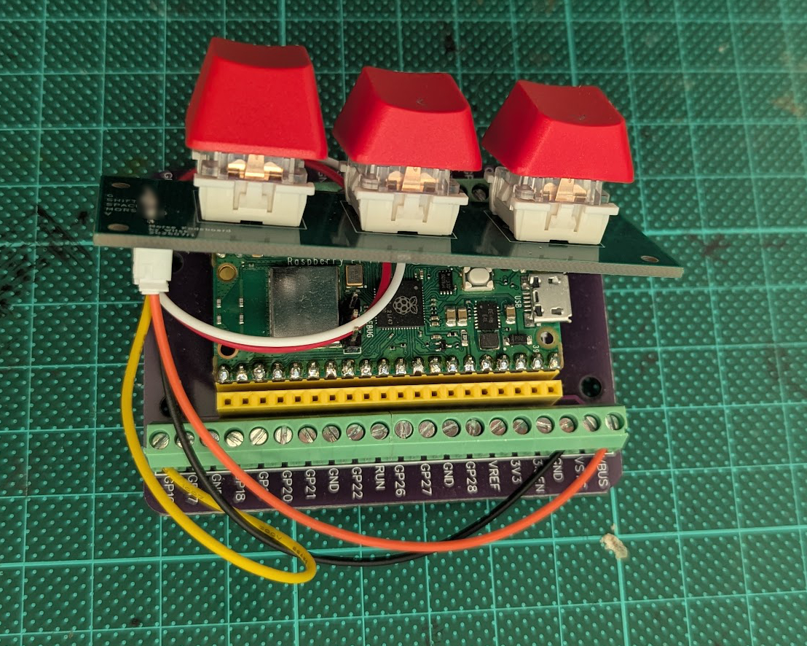
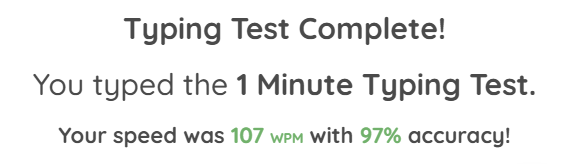
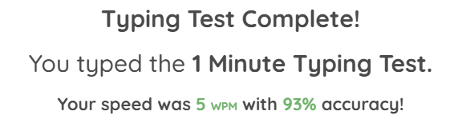

+++
title = "Morse Kodeboard - a Morse Code Keyboard"
description = "The Morse Kodeboard is a custom USB-HID keyboard that turns morse code into keyboard inputs."

[taxonomies]
tag = ["projects", "electronics"]
+++

Here is another project in a long line of "I don't know why I'm doing this"
projects! A while back my family and I spent a week in coastal Victoria as I was
running the Great Ocean Road Marathon. While we were there we visited the
[Cape Otway Lightstation](https://www.lightstation.com), which was an important
lighthouse that helped guide ships through the "Shipwreck Coast".

The Lightstation was also a key part of a 400km long telegraph cable that aimed
to connect Tasmania to the Australian mainland for the first time in the 1850s.
In one of the buildings we spotted a morse code table, and my kids spent half
the long drive back decoding a message written in `dits` and `dahs`.

A few weeks later, I was chatting to a friend about my weakness for clicky, tactile
interfaces and input devices. In my excitement I got a bit careless in my typing
and was forced to defend my accuracy. "I'm typing on my Morse Code keyboard",
I lied in desparation... and then realised I'd found my next project.

The idea was simple - a single button that you tap on long and short pulses. The
keyboard reads the pulses as morse code and outputs the correct codes through a
USB interface.

I decided to call this a:

**—— ——— ·—· ··· · | —·— ——— —·· · —··· ——— ·— ·—· —··**[^1]

You can find the source code + hardware files at <https://github.com/will-hart/morse-kodeboard>.

## Initial build

As this project was a bit of a meme, I didn't really want to over-engineer it.
I've already made quite a few USB-HID interfaces using rust firmware, and I have
a few RaspberryPi Pico's sitting around so the logical choice was to throw together
some [embassy](https://embassy.dev/) firmware and use a third-party morse code
library to decode. By building a simple breadboard circuit I had something up
and running in a couple of evenings.

As usual I had some issues with getting USB descriptors sorted, which
in this case turned out to be because I had a few loops without any "idle" mechanism,
which presumably meant they were hogging 100% of the microcontrollers clock cycles.
This was a fairly easy fix with embassy as I was able to throttle the loops using
a `Ticker`.

## Morse Code Decoding

The next challenge was decoding the button presses into characters. I initially
found a few libraries on crates.io and ran with those, and a couple of these
even supported `no-std`. Unfortunately I found that these libraries didn't quite
work in my use case, as they matched "greedily", meaning that I couldn't continuously
poll.

For example, if I wanted to type `s` (···), then when I polled the decoder in a
loop, I'd get `e e e` (· · ·). So instead I decided to implement my own decoder,
which can be found [on the github](https://github.com/will-hart/morse-kodeboard/blob/main/src/decoder.rs).

Its a fairly basic bit of code that has a "dit time" specified, is fed high and
low edges of a button and converts that into pulse durations and gaps. It then
stores these as dits, dahs and breaks in a ring buffer. The buffer is compared
to a set of acceptable characters using a `match`, for example here is the pattern
for the first few characters:

```rust
if let Some(c) = match self.value_buffer {
            [Dit, Dah, Break, Empty, Empty, Empty] => Some('a'),
            [Dah, Dit, Dit, Dit, Break, Empty] => Some('b'),
            [Dah, Dit, Dah, Dit, Break, Empty] => Some('c'),
            ///...
} {
  // handle a character
  // reset the ring buffer
}
````

Using this approach made decoding a lot simpler, a task could be set up to watch
the morse code button, feed the inputs to the decoder and when a character match
was found, use a channel to feed that character to the task that managed the USB
HID interface.

## More keys?

At this point I realised a few fundamental issues with the one button approach.
For starters, without a space bar it is very hard to write more than one very long
word. So a space key was a must. Secondly, without a shift key, it was very hard
to add punctuation, proper sentence structure or beyond basic text. This might
have been ok in the days when morse code was in regular use, but in this modern
era I'd love to be able to type *most* things without being shouted at for poor
punctuation.

So one key turned into three keys[^2] - a "morse" key, a shift key and a space key.
This in turn meant the firmware now had a lot of different tasks spawned:

1. A `usb_loop` that manages the underlying USB interface
2. A `usb_hid_loop` that manages writing to the USB HID interface
3. A `usb_request_handler` that manages incoming requests on the USB HID interface
4. A `monitor_space_key` task that watches the space button and generates ' ' characters
   for the USB HID loop to send
5. A `generate_morse_code_characters` task, that watches the `shift` and `morse`
   keys and generates the appropriate morse code characters for the `usb_hid_loop`
   to send.

The whole thing is tied together with a series of bounded embassy `Channel`s.

Here is a video of the firmware running on a breadboard device with a debugger
attached:

<video controls muted loop preload="metadata" width="640" height="480" style="margin: -2rem auto 3rem auto;">
  <source src="morse_code_example.webm" type="video/webm">
  Your browser does not support the video tag.
</video>

## Building the hardware

As much as this was a meme project, I felt like adding some hardware would be nice.
I figured as this was a keyboard (and I have some hardware lying around) that
using hot-swappable mechanical switches would be a good first start[^3].

From here making a PCB in Kicad was pretty straightforward, its a connector,
three mechanical switches (using hot-swappable sockets) and a few 0603 pull-up
resistors. It took may an hour or two, then I sent of the gerbers to a Chinese
fab, and a week later for less than a tenner I had a few PCBs to play with.
Soldering was very straightforward by hand and took maybe 20 minutes, although
I have to admit to doing a pretty poor job of the connectors[^4] and they're
straight not right-angled as I'd originally planned.

The resulting frankestein looks like this:



## Typing performance

Ok, I know what you're really here to see is how fast you can type on a Morse
Kodeboard. To keep this comparison fair,  I think some benchmarking is in
order. There are lots of random typing speed tests on the internet, so lets try
to see how fast I can type on the Kodeboard vs a regular keyboard. 

First the control, typing on my Keychron K8:



I do find sometimes I can type faster but then get in loops where the delete key
gets a real work out. Actually, that makes me think - I don't actually have a
delete key on the Kodeboard! We're in too deep now to go back, so I'll just have
to be perfect.

And the Kodeboard results are in:



The kodeboard is about 20x slower, but around the same accuracy if you squnit.
So I guess we call that tie (or should I say a `— ·· ·`)

## What next?

I'm not sure if there is anything next to be honest! It could do with an enclosure.
I have a few options here

1. butcher an electronics project box (maybe a laser cut top),
2. print or laser cut a fully custom enclosure,
3. Look at a more traditional morse code key, of which it seems there are a wide
   [variety of types](https://hamuniverse.com/n2eycodekeys.html)

I could see some other features being added like:

1. A rotary encoder to set the duration of a `dit` (i.e. how fast you have to tap)
2. A delete button
3. Some LEDs indicating i.e. when "shift" is down (actually its more like Capslock)

A this point though I think I've made my point, whatever that is and I may just
throw it in a project box and call it a day.

## Notes

[^1]: Morse Kodeboard, as you may have guessed.
[^2]: Spoiler, its probably going to need more than three keys.
[^3]: Eventually it would be nice perhaps to build a more old-fashioned morse-code style interface, but for now this is still a "keyboard" in the modern sense.
[^4]: The offending soldering work is blurred for your safety.
