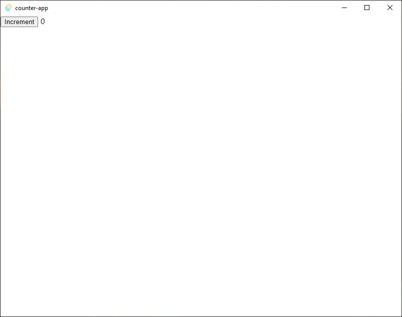

## Why Tauri

[Tauri](https://tauri.studio) is a new cross-platform toolset for creating GUI applications using web technologies. Its a lighter weight alternative to electron, with low memory usage (a few MB), small binary size (as small as 600kB) and built on newer web stacks than some alternative approaches (i.e. WebView2 not MSHTML).

Another key advantage for me is that tauri is built in rust, so you can write your "server-side" logic in rust, and use a simple "command" API to communicate between the rust backend and the web front end.

> At the time of writing this, tauri is at version `1.0.0-beta`, rapidly approaching its first "official" release. The documentation is still a little sparse in some respects, so I'm writing this tutorial to share some of my experiences in setting up a tauri and React app.

## Sample App

This project is going to demonstrate a small sample App built on a tauri and React stack. We're going to build a traditional "counter" app, but this time the logic will be run in the tauri backend and the front end will just display the data.

> The tutorial assumes a basic knowledge of rust and React.

This tutorial will be broken into a few parts:

1) this part, getting set up with [tauri](https://tauri.studio/) and [create-react-app](https://create-react-app.dev/) (CRA),
2) setting up a simple command that we can call from the front end [[link](/20210827_tauri_create_react_app_tutorial_part2)]
3) wrapping the command in `useSWR` to make a generic "invoke" hook, [[link](/20210828_tauri_create_react_app_tutorial_part3)]
4) extending our hook to support multiple counters, [[link](/20210829_tauri_create_react_app_tutorial_part4)]

## Getting ready for tauri

To start with, we need to install the required dependencies. You'll need `node` and `yarn` or `npm` installed, as well as `rust`. If you aren't set up already then tauri provides [some pretty good platform specific instructions](https://tauri.studio/en/docs/getting-started/setup-linux).

If you are on Windows, make sure you have [WebView2](https://tauri.studio/en/docs/getting-started/setup-windows#4-install-webview2) installed.

## Starting with a CRA base

We're going to start by setting up a CRA app in the usual way.

```bash
yarn create react-app counter-app --template typescript
```

Once the packages are installed and the process finishes, open up the folder in your IDE of choice.

```bash
cd counter-app
code .
```

I like to start with a clean slate, so feel free to delete everything non-essential from the repo. In this case I deleted:

- `App.css`,
- `App.test.tsx`, and
- `logo.svg`

I also replaced the contents of `App.tsx` with the following.

```typescript
const App = () => {
  return (
    <div>
      <button>Increment</button> 1
    </div>
  )
}

export default App;
```

You can then start the app to make sure it runs:

```bash
yarn start
```

The simple app should open up in `https://localhost:3000`.

## Adding tauri

The instructions for integrating tauri [can be found here](https://tauri.studio/en/docs/usage/development/integration). Firstly we need to install the Tauri CLI locally.

```bash
yarn add -D @tauri-apps/cli
```

We also want to install the Tauri APIs

```bash
yarn add @tauri-apps/api
```

Finally we initialise Tauri using

```bash
yarn tauri init
```

Just select all the default options for now. After a few mintues the process should complete and there should be a separate `src-tauri` folder where your Tauri app lives. If you open up `src-tauri/tauri.conf.json` you can see all the configuration for the Tauri app. One of the key parts for integrating the CRA app is this bit:

```json
"build": {
  "distDir": "../build",
  "devPath": "http://localhost:3000",
  "beforeDevCommand": "",
  "beforeBuildCommand": ""
},
```

This is how Tauri knows how to run your project in dev, and what to do to build your project. Update the build config as follows:

```json
"build": {
  "distDir": "../build",
  "devPath": "http://localhost:3000",
  "beforeDevCommand": "yarn start",
  "beforeBuildCommand": "yarn build"
},
```

This will ensure that Tauri runs the `yarn start` command when you run it in develop mode, and the `yarn build` command when you build and bundle the app.

I like to add one more shortcut to the root `package.json`,

```json
"scripts": {
  //...
  "dev": "yarn tauri dev"
}
```

Now if I want to develop the app in a browser (outside of Tauri) I can run `yarn start`, and if I want to develop within the Tauri app I can run `yarn dev`.

If everything has gone to plan at this point you should be able to start the Tauri app in dev mode:

```bash
yarn dev
```

It should look something like this:



Both the web app and the Tauri app reload when changes are made. You can verify this by editing our `App.tsx` from `<button>Increment</button> 0` to `<button>Increment</button> 1`. After saving the Tauri app should automatically update.

> The code at this point can be accessed [on github](https://github.com/will-hart/tauri-cra-tutorial/tree/283a4196665c9c014046206fc832c7efb7e31357). Part 2 of the series [can be found here](/20210827_tauri_create_react_app_tutorial_part2)
