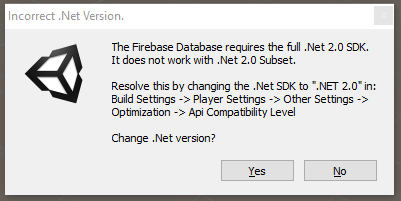

## All your firebases are belong to us?

Playing around with a React web app recently I was working through ideas for the
app backend, and after weighing up a bunch of different options I decided to
give [Firebase](https://firebase.google.com/) a go so I could concentrate on the
frontend. I'd played with firebase a while back (before it was acquired by
google) but it had never really clicked with me. That was before I used React
for web/mobile apps, and I quickly found that firebase is _made_ for the
React/Redux architecture; the first time I changed something on my PC browser
and it immediately popped up on my mobile browser (without any special code from
me) I was hooked.

In case you aren't aware, firebase is a bunch of different things, but the
interesting features for me are it provides a user logins, a real-time[1]
JSON-like database backend with fine grained read/write permissions, and
integrated file storage. The interface is really easy, all data is just accessed
by URLs, like (`/myfirebaseurl/users/1234/username`). It has APIs for
JavaScript, and ... wait, did they just say [Unity
support](https://firebase.google.com/docs/unity/setup)?

> **NOTE** Before I get any further: currently firebase only supports Android
> and iOS builds by default. If you stick around until the end, I've managed to
> get it working in standalone builds but it is a little hacky. The best thing I
> can suggest is to try to badger firebase through twitter or (shudder) google
> groups to add support for Standalone builds!
>
> I [asked for an
> update](https://groups.google.com/d/topic/firebase-talk/XLaACoVjysc/discussion)
> on the google groups page, but at the time of writing this I haven't heard
> anything back.

Suddenly, gears started grinding in my head, shaking off the piles of rust that
had accumulated. Visions of real-time backend features, like the [global
statistics](http://arrowheadgamestudios.com/games/helldivers/helldivers-war-statistics/)
from [Helldivers](http://arrowheadgamestudios.com/games/helldivers/) swam before
my eyes. Or, what about [Warcube's](http://www.warcubegame.com/) [gif recording
feature](https://github.com/Chman/Moments), with automatic uploads so that they
can be featured on a game's website in real-time. When you start to go down this
path, there are lots of ways to make players feel connected while playing your
game.

Of course, it isn't all roses. During development of the web app I was prompted
to tweet this:


There is a bit of learning curve using firebase, but its not insurmountable, and
I was pretty impressed to see one of the firebase staff find the tweet and ask
me for further feedback... thumbs up for good community engagement!

So, that aside, I present to you - a basic introduction in creating real-time
"social" features in your Unity games using Google's Firebase backend (in two
parts)! We're going to create a very simple stats feature, which counts the
number of mouse clicks and saves it globally so all users can see it in
real-time. I'm going to assume you are comfortable with Unity so will gloss over
the Unity basics for the sake of brevity.

## Getting Started

### Setting up Firebase

Firebase at the moment has a pretty decent free tier, which gives you a bunch of
storage and bandwidth. Go ahead and sign up now if you are following along. Once
you are signed in, create a new application following their prompts. I'm going
to call mine `wilsk_unity_test`, but you can call yours whatever you want (see
note 2)


Once you have created the database, click the "Database" link on the left hand
menu, here you can see your database contents. It might look something like
this:


You can see the firebase URL - `http://wh-unity-test.firebaseio.com/` and the root
of the database, `wh-unity-test` with a value of `null`.

Next we need to set up some database permissions. These control who can read or
write what data, and also validation rules for the data. Click on the `RULES` tab
above the database URL. You should see a text box containing the default rules
in JSON format:

```json
{
  "rules": {
    ".read": "auth != null",
    ".write": "auth != null"
  }
}
```

These rules just specify that anybody who is logged in can read or write
anything. For now we don't want any real restrictions, but we also don't want a
massive free for all. Lets say we want to be able to increment a counter, and
everything else should be rejected. Paste the following into the text box,
replacing the current rules:

```json
{
  "rules": {
    "counter": {
      ".validate": "newData.isNumber()",
      ".read": "true",
      ".write": "true"
    }
  }
}
```

This looks a little intimidating, but what it does is quite straightforward.
Basically for the `counter` path on the database, i.e. if we access
`http://wh-unity-test.firebaseio.com/counter`, it allows read and write by
default. When we write to the path, any value is accepted as long as it is a
number, this is the `newData.isNumber()` part. Anything not specified in the
rules is rejected by default.

You will probably notice a "Simulator" button on the top right of the text box.
This lets us try out our rules before saving them. Have a play and verify that
the rules prevent access outside of `counter` and reject attempts to write text or
other data to the `/counter` path.


When you are happy, hit `PUBLISH` and our database setup is done. We'll come
back to the database in a little while.

### Setting up Unity

The next thing is to get Unity setup. Download the Unity SDK from
https://firebase.google.com/docs/unity/setup, the package comes with a bunch of
`.unitypackage` files which contain the code for different feature sets.


Lets start a new Unity project and import the `FirebaseDatabase.unitypackage`
package. We're going to skip authentication for now as it makes life a bit more
complicated (see note 3). You should see something like this screen when you
drop the package in:


You might get a warning about having the wrong SDK version. Just follow the
instructions on screen to configure the project correctly for firebase.



### Ready to rock

OK, with that I think we are ready to start building up our application. Stay
tuned for [part 2](/firebase-and-unity-part-2)!

## Notes

1. Real-time as in you can subscribe to a particular database field, and when
   anybody updates the value all subscribers get notified. Think a chat site,
   where new messages are automatically pushed to other users as soon as they
   are posted.
2. If the name you pick is already taken then you will end up with a short
   series of random characters after the name you pick.
3. Also, I'm not even sure that authentication / authorisation is possible in
   standalone builds with the current library.
